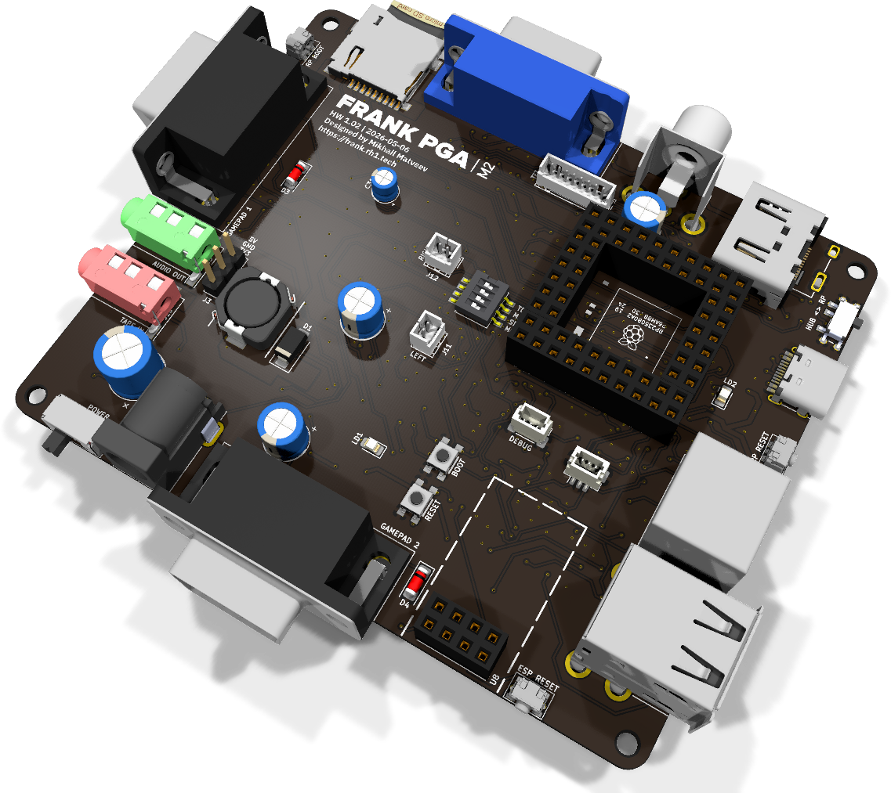
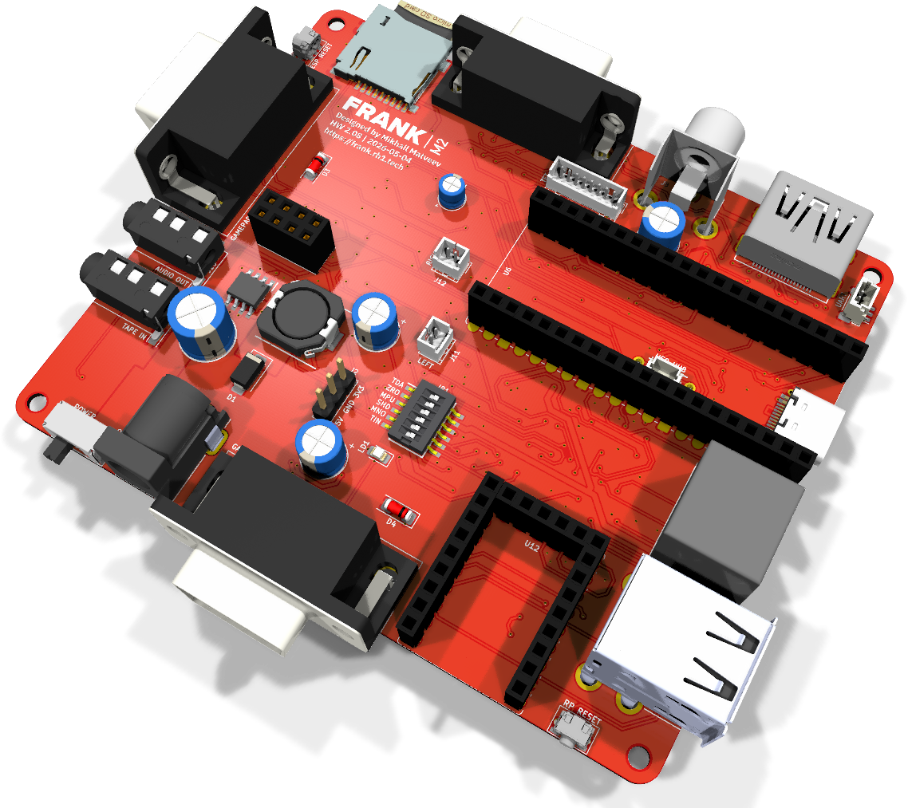
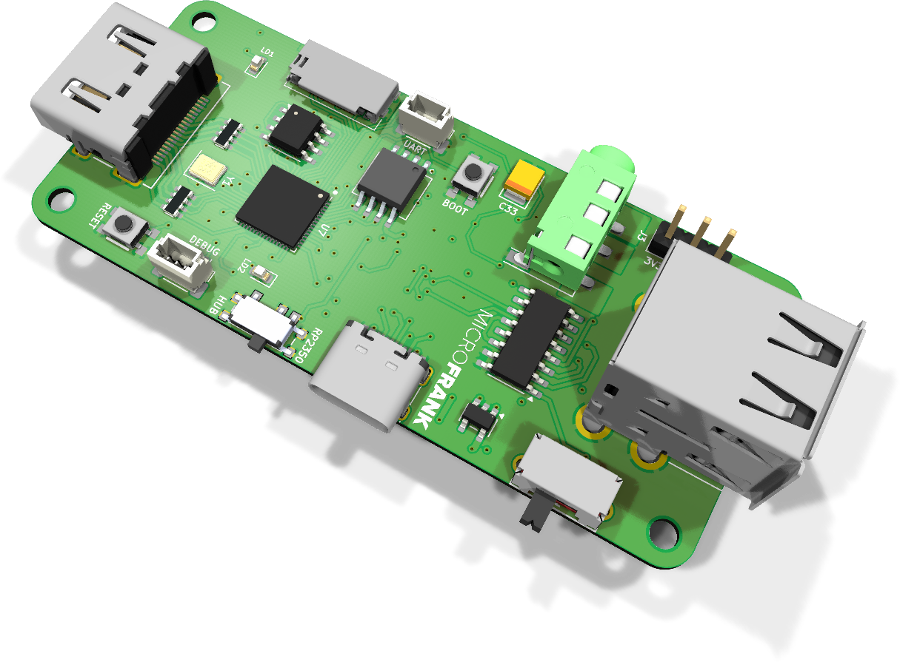

# FRANK

FRANK is a hardware emulation platform built around the Raspberry Pi RP2350 (Pico 2 modules and RP2350A QFN). RP2040 / Pico is supported on FRANK's socket as well, but in practice only a handful of firmware (mainly the older ZX Spectrum cores) still target RP2040. Everything modern — IBM PC, NES, SNES, Genesis, the DOOM / id Tech 1 ports, FRANK OS, and so on — is RP2350-only.

It started as a fork of the [Murmulator](https://murmulator.tilda.ws/) project by [Alex Ekb](https://t.me/Alex_Eburg). Over time it picked up extra video outputs, audio paths, USB and WiFi support, and several form factors.

The name comes from "Frankenstein". The board is stitched together from parts of different projects, so the name stuck.

## Looking for an older board?

This repository now ships only the boards under `hardware/` that are actively maintained. The `accessories/` and `archive/` directories are gone. Older revisions, retired boards, and accessory adapters such as HDMI2VGA and USB2PS2 live in [rh1tech/frank-archive](https://github.com/rh1tech/frank-archive).

Experimental and work-in-progress designs live in [rh1tech/frank-lab](https://github.com/rh1tech/frank-lab).

## The boards in this repo

Four maintained boards, each with its own KiCad project, gerbers, BOM and assembly drawings.

| Board | Render | PCB size | Compute | Best for |
|-------|:------:|----------|---------|----------|
| [FRANK PGA](./hardware/frank_pga) |  | 99.5 × 83.1 mm | Pimoroni PGA2350 (RP2350A module) | The flagship. Every output on one PCB, native USB host with multiplexer, ESD-protected. |
| [FRANK](./hardware/frank) |  | 99.5 × 83.1 mm | Raspberry Pi Pico / Pico 2 (socket) + RP2040-Zero | Socketed alternative. Easiest to solder, swap Pico modules at will, USB-to-PS/2 helper on board. |
| [MiniFRANK](./hardware/minifrank) |  | 85.6 × 53.98 mm | RP2350A QFN, on-board | Compact full-feature board with WiFi, VGA, HDMI and one gamepad port. |
| [MicroFRANK](./hardware/microfrank) |  | 32 × 74 mm | RP2350A QFN, on-board | Smallest board. HDMI only, no PS/2, no gamepad. Good for embedded use. |

All four boards use the M2 GPIO layout, so any firmware build for M2 runs on all of them (subject to the feature differences below).

### Comparison table

| Feature | FRANK PGA | FRANK | MiniFRANK | MicroFRANK |
|---------|:---------:|:-----:|:---------:|:----------:|
| Compute module | Pimoroni PGA2350 | Pico / Pico 2 (socket) | RP2350A QFN on-board | RP2350A QFN on-board |
| On-board flash | via module | via module | W25Q128 (16 MB) | W25Q128 (16 MB) |
| On-board PSRAM | via module | via module | 8 MB | 8 MB |
| HDMI output | Yes | Yes | Yes | Yes |
| VGA output | Yes | Yes | Yes | — |
| Composite (RCA) | Yes | Yes | — | — |
| TFT display header | Yes | Yes | — | — |
| Hardware PS/2 port | Yes | Yes | Yes | — |
| USB-emulated PS/2 (RP2040-Zero) | — | Yes | — | — |
| Gamepad ports (DB9) | 2 | 2 | 1 | — |
| Stacked USB Type-A host | Yes | Yes | Yes | Yes |
| MW7211A USB hub | Yes | Yes | Yes | Yes |
| USB host multiplexer | 74HC4052D | — | TS3USB221 | TS3USB221 |
| USBLC6 ESD protection | Yes | — | Yes | Yes |
| ESP-01S WiFi socket | Yes | Yes | Yes | — |
| Tape input (3.5 mm) | Yes | Yes | Yes | — |
| Audio output | 3.5 mm jack | 3.5 mm jack | 3.5 mm jack | 3.5 mm jack |
| TDA1387 DAC | Yes | Yes | Yes | Yes |
| PAM8403 speaker amp | Yes | Yes | — | — |
| Power input | DC barrel jack | DC barrel jack | USB-C | USB-C |
| Voltage regulator | MP1584 buck + AMS1117 LDO | MP1584 buck + AMS1117 LDO | AMS1117 LDO | ME6211 LDO |
| Power switch | Slide | Slide | Slide | Slide |
| Mounting holes | 4 × 2.7 mm | 4 × 2.7 mm | 4 × 2.7 mm | 4 × 2.7 mm |

## Supported software

Over thirty emulators and native ports run on FRANK boards.

### Console emulators

| Firmware | Platform | Repository | PSRAM required |
|----------|----------|------------|----------------|
| frank-nes | NES / Famicom (Dendy) | [frank-nes](https://github.com/rh1tech/frank-nes) | Yes (8 MB) |
| frank-snes | SNES / Super Famicom | [frank-snes](https://github.com/rh1tech/frank-snes) | Yes (8 MB) |
| frank-genesis | Sega Genesis / Mega Drive | [frank-genesis](https://github.com/rh1tech/frank-genesis) | Yes (8 MB) |
| frank-c64 | Commodore 64 | [frank-c64](https://github.com/rh1tech/frank-c64) | Yes (8 MB) |
| frank-apple | Apple IIe | [frank-apple](https://github.com/rh1tech/frank-apple) | Optional |
| frank-msx | MSX / MSX2 / MSX2+ (fMSX core) | [frank-msx](https://github.com/rh1tech/frank-msx) | Yes (8 MB) |

### PC emulation

| Firmware | Platform | Repository | PSRAM required |
|----------|----------|------------|----------------|
| frank-386 | IBM PC i386 (DOS, Windows 3.x/95, Linux) | [frank-386](https://github.com/rh1tech/frank-386) | Yes (8 MB) |

### Game engine ports

| Firmware | Game | Repository | PSRAM required |
|----------|------|------------|----------------|
| frank-idtech1 | DOOM, Heretic, Hexen, Strife (all-in-one) | [frank-idtech1](https://github.com/rh1tech/frank-idtech1) | Yes (8 MB) |
| frank-doom | DOOM (standalone) | [frank-doom](https://github.com/rh1tech/frank-doom) | Yes (8 MB) |
| frank-heretic | Heretic | [frank-heretic](https://github.com/rh1tech/frank-heretic) | Yes (8 MB) |
| frank-wolf3d | Wolfenstein 3D | [frank-wolf3d](https://github.com/rh1tech/frank-wolf3d) | Yes (8 MB) |
| frank-duke3d | Duke Nukem 3D | [frank-duke3d](https://github.com/rh1tech/frank-duke3d) | Yes (8 MB) |
| frank-prince | Prince of Persia | [frank-prince](https://github.com/rh1tech/frank-prince) | Yes (8 MB) |
| frank-digger | Digger Remastered | [frank-digger](https://github.com/rh1tech/frank-digger) | No |
| frank-quest | ScummVM (AGI, SCI, SCUMM v1–v7, GOB, KYRA — King's Quest, Monkey Island, Day of the Tentacle, Full Throttle, Gobliiins, Kyrandia and more) | [frank-quest](https://github.com/rh1tech/frank-quest) | Yes (8 MB) |

### OS and utilities

| Firmware | Description | Repository | PSRAM required |
|----------|-------------|------------|----------------|
| frank-os | Full desktop OS (Windows 95-style GUI, apps, built-in emulators) | [frank-os](https://github.com/rh1tech/frank-os) | Yes (8 MB) |
| frank-kickstart | UF2 firmware launcher with SD card browser | [frank-kickstart](https://github.com/rh1tech/frank-kickstart) | Optional |
| frank-manul | Text-mode web browser (HTTP/HTTPS via ESP-01 WiFi) | [frank-manul](https://github.com/rh1tech/frank-manul) | Yes (8 MB) |
| frank-netcard | AT modem firmware for the ESP-01 WiFi module | [frank-netcard](https://github.com/rh1tech/frank-netcard) | No |

### Murmulator firmware

The original [Murmulator](https://murmulator.ru/) project provides additional firmware that runs on FRANK boards as well:

**ZX Spectrum cores:** ZX Spectrum 48K / 128K / +3e (tecnocat, pico-spec, frut-bat, ZX Speccy P, murmulator), ZX Elf (pico-alf).

**Other cross-platform emulators:** MS-DOS IBM PC XT 8088, BK-0010 / BK-0011M, Radio 86RK, Macintosh, Atari 800, NES / Famicom / Dendy, Sega Master System / Game Gear, NEC PC Engine / TurboGrafx-16, Nintendo GameBoy / GameBoy Color, Watara Supervision, Atari Lynx, Bandai Wonderswan / Wonderswan Color, NeoGeo Pocket Color, Gamate, Game & Watch / Elektronika.

**Tools and applications:** MurmulatorOS, Picomite MMBasic, VersaTerm, the original Murmulator bootloader.

### Other compatible boards

Most firmware also runs on:

- Murmulator (M1 and M2)
- Olimex PICO-PC (some firmware)
- Waveshare RP2350-PiZero (some firmware)

## Getting started

1. Order or fab the PCB (gerbers are in each board's `gerbers/` directory).
2. Source the components using the BOM (`hardware/<board>/docs/<rev>/bom.html`).
3. Solder following the [board-specific guide](./docs/) — start with the smallest passives and work outwards.
4. Flash firmware: hold BOOTSEL on the RP chip, plug USB, release, copy a `.uf2` file to the drive that appears (or use `picotool load`).
5. Insert an SD card with ROMs, WADs or disk images.
6. Plug in a display (HDMI or VGA), keyboard (PS/2 or USB) and gamepad.

For quick switching between firmware, flash [frank-kickstart](https://github.com/rh1tech/frank-kickstart) first. It gives you a graphical launcher that re-flashes from SD without touching BOOTSEL again.

## PSRAM

Most modern firmware (frank-os, frank-quest, frank-386, frank-genesis, frank-snes, frank-msx, frank-idtech1, frank-doom and so on) needs 8 MB of PSRAM. Some firmware refuses to boot without it: frank-quest installs a custom dlmalloc backed entirely by external PSRAM (`drivers/psram_init.c`, `drivers/dlmalloc.c`) because the runtime — heap-allocated game state, decoded resources, mixer ring buffers, font caches — does not fit in the RP2350's 520 KB of SRAM.

How you get PSRAM depends on the board:

- **MiniFRANK and MicroFRANK** — PSRAM is already on-board (8 MB ESP-PSRAM64). Nothing to do.
- **FRANK PGA** — the Pimoroni PGA2350 module already includes 8 MB PSRAM. Nothing to do.
- **FRANK** — the socketed Pico 2 has no PSRAM by default. Three ways to fix this:
  1. **Pimoroni Pico Plus 2 (recommended).** A ready-made Pico 2 with 8 MB PSRAM. Drop it into the socket and you are done.
  2. **Solder a PSRAM chip on top of the flash chip of an RP2350 clone.** SOP-8 flash chips are mostly only on clones (typically black boards), not the original Pico 2 — you cannot do this trick on a genuine Pico 2.
  3. **Build a Nyx 2** — a DIY RP2350 board with integrated PSRAM.

## Repo layout

```
hardware/      Board KiCad projects (frank, frank_pga, minifrank, microfrank)
docs/          Shared component datasheets and assembly notes
software/      Pre-built UF2s. Currently ships Hecate, the USB-to-PS/2 bridge
               firmware for FRANK's on-board RP2040-Zero — flashing it lets a
               USB keyboard or mouse appear on the hardware PS/2 lines.
               Source: https://github.com/rh1tech/hecate
```

## Documentation

Each board has its own assembly and usage guide:

- [FRANK PGA assembly and usage guide](./docs/frank_pga.md)
- [FRANK assembly and usage guide](./docs/frank.md)
- [MiniFRANK assembly and usage guide](./docs/minifrank.md)
- [MicroFRANK assembly and usage guide](./docs/microfrank.md)

The `hardware/<board>/docs/` directories also contain auto-generated BOMs (`bom.html`) and assembly drawings (`assembly.pdf`, `schematics.pdf`) for each PCB revision.

## Links

- [rh1.tech/projects/frank](https://rh1.tech/projects/frank) — project website
- [rh1tech/frank-archive](https://github.com/rh1tech/frank-archive) — older boards and accessories
- [rh1tech/frank-lab](https://github.com/rh1tech/frank-lab) — experimental designs

### Firmware repositories

Console emulators:

- [frank-nes](https://github.com/rh1tech/frank-nes) — NES / Famicom (Dendy)
- [frank-snes](https://github.com/rh1tech/frank-snes) — SNES / Super Famicom
- [frank-genesis](https://github.com/rh1tech/frank-genesis) — Sega Genesis / Mega Drive
- [frank-c64](https://github.com/rh1tech/frank-c64) — Commodore 64
- [frank-apple](https://github.com/rh1tech/frank-apple) — Apple IIe
- [frank-msx](https://github.com/rh1tech/frank-msx) — MSX / MSX2 / MSX2+

PC emulation:

- [frank-386](https://github.com/rh1tech/frank-386) — IBM PC i386 (DOS, Windows 3.x/95, Linux)

Game engine ports:

- [frank-idtech1](https://github.com/rh1tech/frank-idtech1) — DOOM, Heretic, Hexen, Strife (all-in-one)
- [frank-doom](https://github.com/rh1tech/frank-doom) — DOOM (standalone)
- [frank-heretic](https://github.com/rh1tech/frank-heretic) — Heretic
- [frank-wolf3d](https://github.com/rh1tech/frank-wolf3d) — Wolfenstein 3D
- [frank-duke3d](https://github.com/rh1tech/frank-duke3d) — Duke Nukem 3D
- [frank-prince](https://github.com/rh1tech/frank-prince) — Prince of Persia
- [frank-digger](https://github.com/rh1tech/frank-digger) — Digger Remastered
- [frank-quest](https://github.com/rh1tech/frank-quest) — ScummVM (AGI, SCI, SCUMM, GOB, KYRA)

OS and utilities:

- [frank-os](https://github.com/rh1tech/frank-os) — Full desktop OS with built-in emulators
- [frank-kickstart](https://github.com/rh1tech/frank-kickstart) — UF2 firmware launcher
- [frank-manul](https://github.com/rh1tech/frank-manul) — Text-mode web browser
- [frank-netcard](https://github.com/rh1tech/frank-netcard) — AT modem firmware for ESP-01
- [hecate](https://github.com/rh1tech/hecate) — USB-to-PS/2 bridge for the RP2040-Zero

## Author

Mikhail Matveev — software engineer and hardware developer based in Thessaloniki, Greece. Background in software architecture, QA and open-source development. Builds retro computing hardware and writes firmware for fun. More projects at [rh1.tech](https://rh1.tech).

## License

&copy; 2026 Mikhail Matveev, <xtreme@rh1.tech>

GPL v3. See [LICENSE](./LICENSE).
