# FRANK

FRANK is a hardware emulation platform built around the Raspberry Pi RP2350 (Pico 2 modules and RP2350A QFN). RP2040 / Pico still works in FRANK's socket, but in practice only a handful of firmware (mainly the older ZX Spectrum cores) still targets RP2040. Everything modern (IBM PC, NES, SNES, Genesis, the DOOM / id Tech 1 ports, FRANK OS, and so on) is RP2350-only.

It started as a fork of the [Murmulator](https://murmulator.tilda.ws/) project by [Alex Ekb](https://t.me/Alex_Eburg). Over time it picked up extra video outputs, audio paths, USB and WiFi support, and several form factors.

The name comes from "Frankenstein". The board is stitched together from parts of different projects, so the name stuck.

## Looking for an older board?

This repository now ships only the boards under `hardware/` that are actively maintained. The `accessories/` and `archive/` directories are gone. Older revisions, retired boards, and accessory adapters such as HDMI2VGA and USB2PS2 live in [rh1tech/frank-archive](https://github.com/rh1tech/frank-archive).

Experimental and work-in-progress designs live in [rh1tech/frank-lab](https://github.com/rh1tech/frank-lab).

## The boards in this repo

Eleven maintained boards, each with its own KiCad project, gerbers, BOM and assembly drawings, plus two add-on modules ([TurboSound](#modules) and [Hecate](#modules)) and three [retro-CPU boards](#retro-cpu-boards).

| Board | Render | PCB size | Compute | Best for |
|-------|:------:|----------|---------|----------|
| [FRANK Next](./hardware/frank_next) | 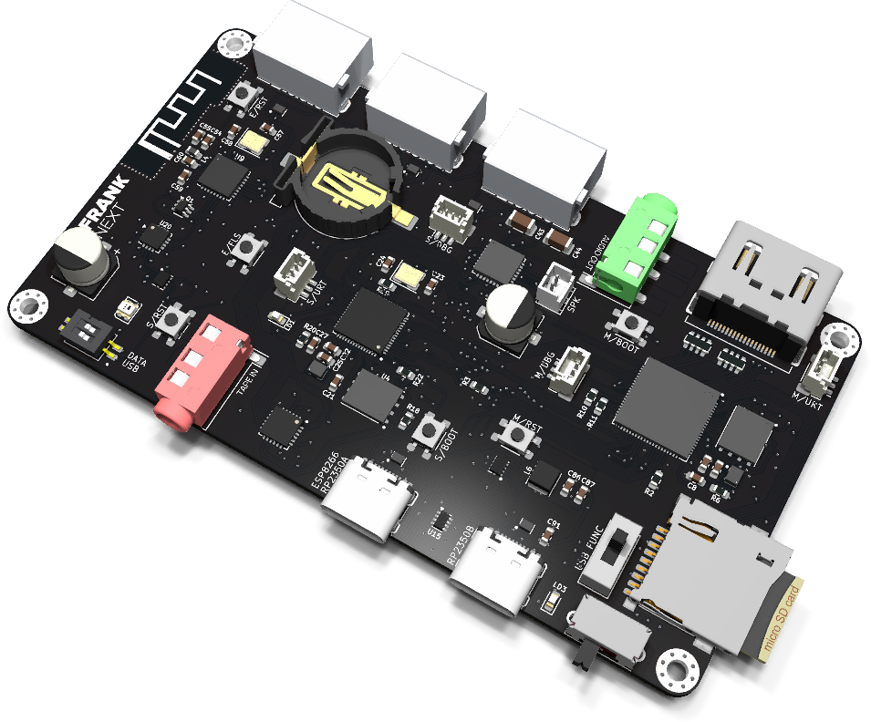 | 99.0 × 53.98 mm | RP2350B + RP2350A, both on-board | **Flagship.** Two RP2350 dies, on-board ESP8266EX WiFi, CH343P console, three USB-A host ports. |
| [MegaFRANK](./hardware/megafrank) | 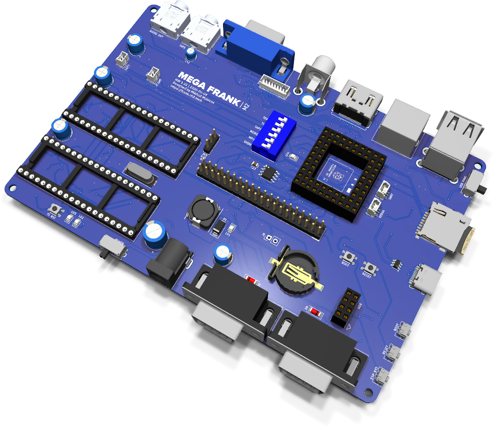 | 149.9 × 99.5 mm | Pimoroni PGA2350 (RP2350B module) | Maximal board — every output plus on-board dual-AY TurboSound, DS3231 RTC and dual power input. |
| [FRANK PGA](./hardware/frank_pga) | 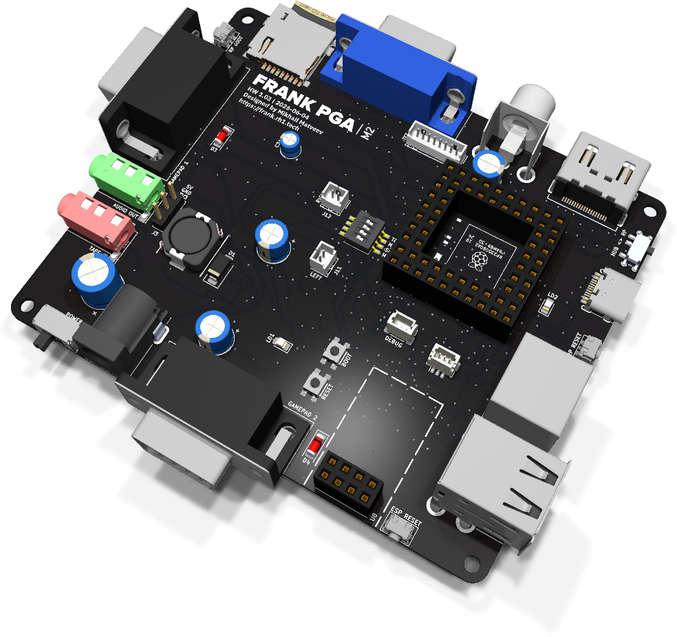 | 99.5 × 83.1 mm | Pimoroni PGA2350 (RP2350A module) | Every output on one PCB, native USB host with multiplexer, ESD-protected. |
| [FRANK](./hardware/frank) | 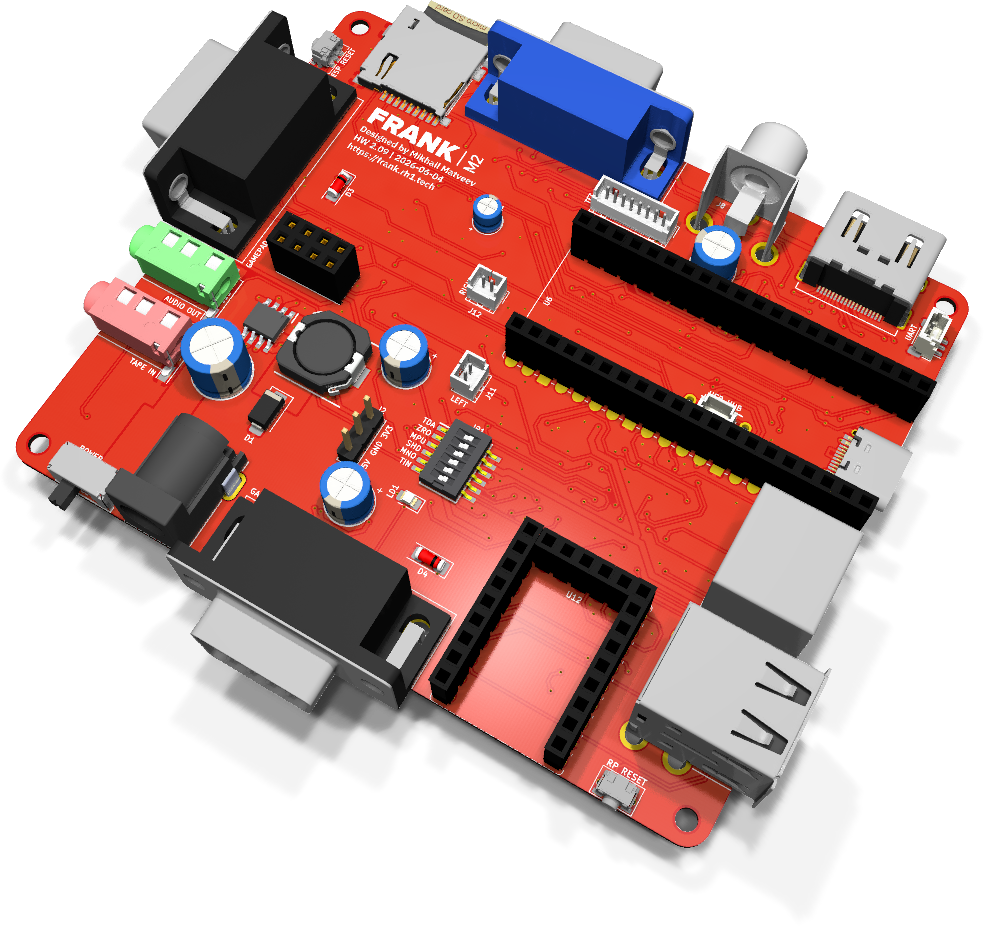 | 99.5 × 83.1 mm | Raspberry Pi Pico / Pico 2 (socket) + RP2040-Zero | Socketed alternative. Easiest to solder, swap Pico modules at will, USB-to-PS/2 helper on board. |
| [Old Skool FRANK](./hardware/oldskool) |  | 100.0 × 79.0 mm | Pimoroni PGA2350 (RP2350B module) | The retro-connector board: HDMI **and** VGA, hardware PS/2, DB9 gamepad. Only 2-layer design, easiest to hand-assemble. |
| [MiniFRANK](./hardware/minifrank) | 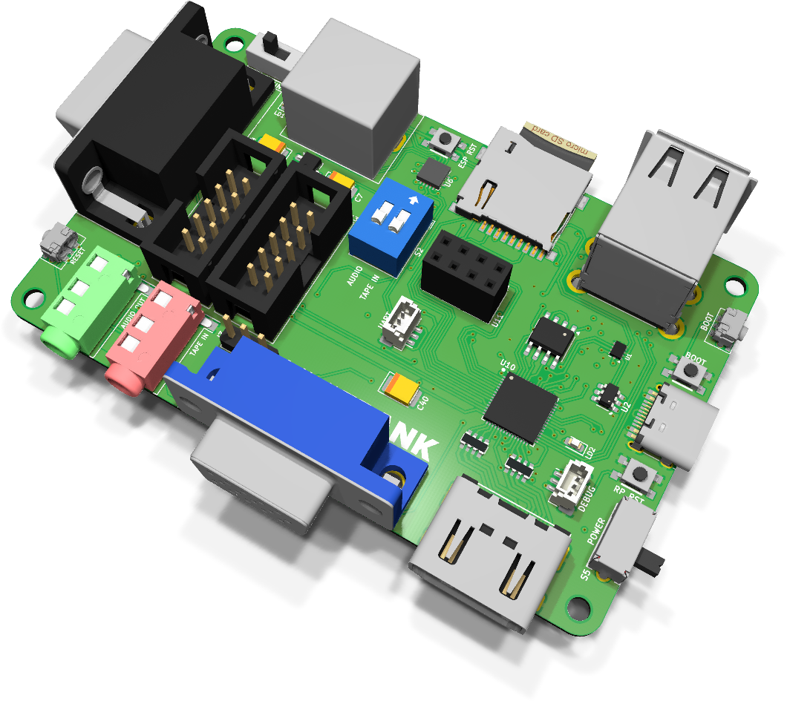 | 85.6 × 53.98 mm | RP2350A QFN, on-board | Compact full-feature board with WiFi, VGA, HDMI and one gamepad port. |
| [FRANK Core 2](./hardware/frank_core2) |  | 80.56 × 53.98 mm | RP2350B + RP2350A, both on-board | FRANK Next shrunk: same dual-die architecture with an ESP-01 socket and two USB-A ports. |
| [FRANK Core 2U](./hardware/frank_core2u) |  | 67.0 × 55.0 mm | RP2350B + RP2350A, both on-board | Smallest dual-die board. Video, sound, storage and USB only — no WiFi, no RTC. |
| [MicroFRANK](./hardware/microfrank) | 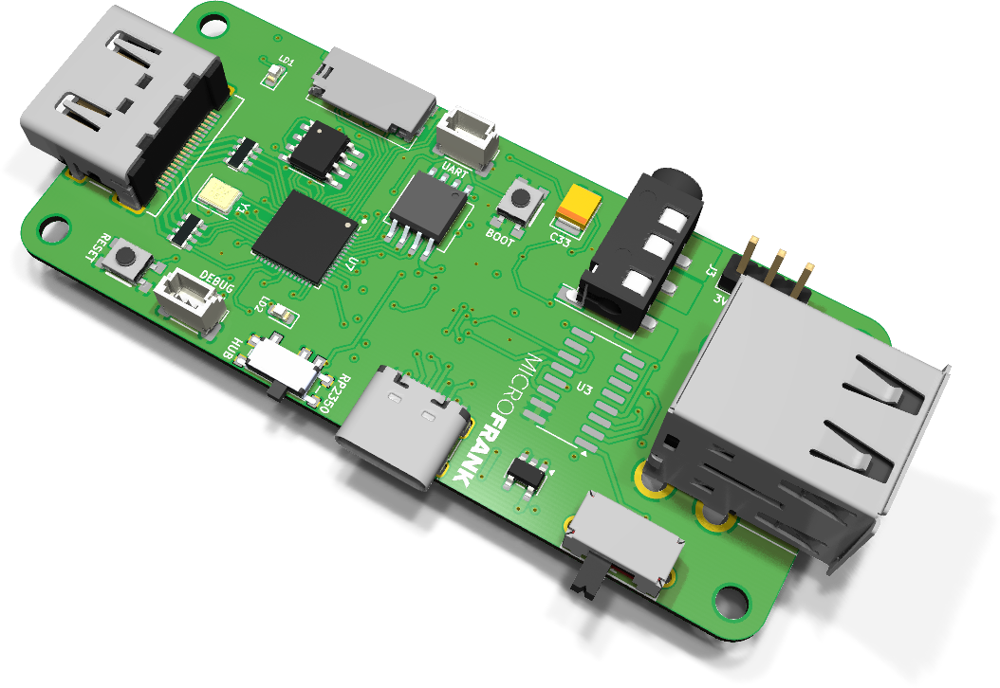 | 32 × 74 mm | RP2350A QFN, on-board | Smallest single-die board. HDMI only, no hardware PS/2 or DB9 gamepad. Keyboards, mice and gamepads connect over the stacked USB host. |
| [ZeroFRANK](./hardware/zerofrank) | 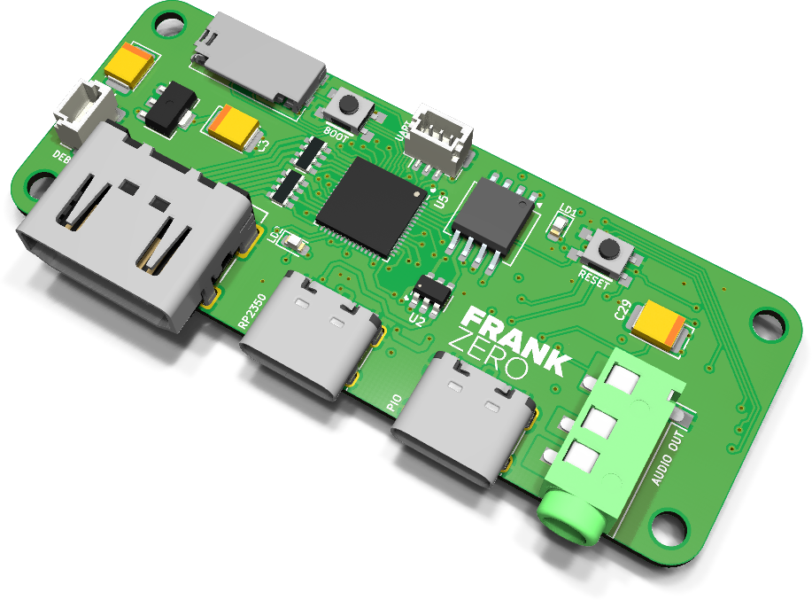 | 65 × 25 mm | RP2350A QFN, on-board | Smallest RP2350A board. HDMI only, USB host for input, on-board flash + PSRAM + I²S audio. |
| [Nyx](./hardware/nyx) | 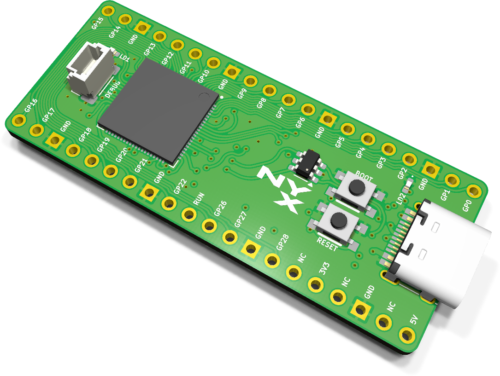 | 51 × 21 mm | RP2350B QFN, on-board | Open-source Pico 2 clone with built-in PSRAM. Drop-in replacement for Pico Plus 2 in the FRANK socket. |

The full-size and compact boards use the M2 GPIO layout, so any firmware build for M2 runs on them (subject to the feature differences below). FRANK Next, Core 2 and Core 2U are the exception: they carry two RP2350 dies and firmware must be built for that split, or the slave simply sits idle. Nyx is a compute module — it plugs into the FRANK socket and provides the RP2350B, flash and PSRAM; the FRANK motherboard provides all the I/O.

### Comparison: full-size boards

| Feature | MegaFRANK | FRANK PGA | FRANK | Old Skool |
|---------|:---------:|:---------:|:-----:|:---------:|
| Compute | Pimoroni PGA2350 | Pimoroni PGA2350 | Pico / Pico 2 (socket) | Pimoroni PGA2350 |
| Copper layers | 4 | 4 | 4 | **2** |
| On-board flash | via module | via module | via module | via module |
| On-board PSRAM | via module | via module | via module | via module |
| HDMI output | Yes | Yes | Yes | Yes |
| VGA output | Yes | Yes | Yes | Yes |
| Composite (RCA) | Yes | Yes | Yes | — |
| TFT display header | Yes | Yes | Yes | — |
| Hardware PS/2 port | Yes | Yes | Yes | Yes |
| USB-emulated PS/2 (RP2040-Zero) | — | — | Yes | — |
| Gamepad ports (DB9) | 2 | 2 | 2 | 1 |
| Stacked USB Type-A host | Yes | Yes | Yes | Yes |
| USB hub | MW7211A | MW7211A | MW7211A | MW7211A |
| USB host multiplexer | 74HC4052D | 74HC4052D | — | 74HC4052 |
| USBLC6 ESD protection | Yes | Yes | — | — |
| WiFi | ESP-01S socket | ESP-01S socket | ESP-01S socket | ESP-01S socket |
| Real-time clock | DS3231 | — | — | — |
| Tape input (3.5mm) | Yes | Yes | Yes | Yes |
| Audio DAC | TDA1387 | TDA1387 | TDA1387 | TDA1545A + LM358 |
| PAM8403 speaker amp | Yes | Yes | Yes | — |
| Power input | DC barrel jack (×2) | DC barrel jack | DC barrel jack | USB-C / USB-B |
| Voltage regulator | MP1584 buck + AMS1117 LDO | MP1584 buck + AMS1117 LDO | MP1584 buck + AMS1117 LDO | AMS1117 LDO |
| Mounting holes | 4 × 2.7 mm | 4 × 2.7 mm | 4 × 2.7 mm | 4 × 2.7 mm |

On-board TurboSound (dual YM2149), a DS3231 real-time clock and a DS2401 silicon serial number are unique to MegaFRANK. Old Skool FRANK is the only 2-layer board in the repo, which makes it the friendliest to hand-assembly and rework.

### Comparison: compact boards

| Feature | FRANK Next | MiniFRANK | Core 2 | Core 2U | MicroFRANK | ZeroFRANK |
|---------|:----------:|:---------:|:------:|:-------:|:----------:|:---------:|
| Compute | RP2350B + RP2350A | RP2350A QFN | RP2350B + RP2350A | RP2350B + RP2350A | RP2350A QFN | RP2350A QFN |
| On-board flash | 2 × W25Q128 | W25Q128 | 2 × W25Q128 | 2 × W25Q128 | W25Q128 | W25Q128 |
| On-board PSRAM | 2 × 8 MB | 8 MB | 2 × 8 MB | 2 × 8 MB | 8 MB | 8 MB |
| HDMI output | Yes | Yes | Yes | Yes | Yes | Yes |
| VGA output | — | Yes | — | — | — | — |
| Hardware PS/2 port | — | Yes | — | — | — | — |
| Gamepad ports (DB9) | — | 1 | — | — | — | — |
| USB Type-A host ports | 3 | 2 (stacked) | 2 | 2 | 2 (stacked) | — (USB-C PIO host) |
| USB hub | CH334F | MW7211A | CH334F | MW7211A | MW7211A | — |
| USB host multiplexer | TS3USB221 × 2 | TS3USB221 | TS3USB221 | TS3USB221 | TS3USB221 | — |
| USB serial bridge | CH343P | — | — | — | — | — |
| WiFi | ESP8266EX on-board | ESP-01S socket | ESP-01 socket | — | — | — |
| Real-time clock | DS3231MZ | — | DS3231MZ | — | — | — |
| Tape input (3.5mm) | Yes | Yes | Yes | Yes | — | — |
| Audio DAC | TLV320DAC3100 | TDA1387 | TLV320DAC3100 | TDA1387T + LM358 | TDA1387 | TDA1387 |
| Power input | USB-C | USB-C | USB-C | USB-C | USB-C | USB-C |
| Voltage regulator | SY8089 buck | AMS1117 LDO | SY8089 buck | AMS1117 LDO | ME6211 LDO | AMS1117 LDO |
| Mounting holes | 4 × 2.5 mm plated | 4 × 2.7 mm | 4 × 2.5 mm plated | 4 × 2.5 mm plated | 4 × 2.7 mm | 4 × 2.7 mm |

FRANK Next, Core 2 and Core 2U share the dual-RP2350 architecture: an RP2350B master for emulation and an RP2350A slave for USB host, audio and housekeeping. Core 2U comes from a different subsystem generation than Core 2 — ESP-PSRAM64H instead of APS6404L, a discrete TDA1387T audio chain instead of the TLV320DAC3100 codec, and no WiFi or RTC.

## Retro CPU boards

These are not emulation boards. Each carries a real vintage CPU in a DIP-40 socket, with an RP2350B acting as the chipset — memory, video, storage and I/O. They do not run the FRANK emulation firmware; each has its own chipset firmware.

| Board | Render | PCB size | CPU | Notes |
|-------|:------:|----------|-----|-------|
| [Dino Z80](./hardware/dino_z80) |  | 99.5 × 80.0 mm | Zilog Z84C0020PEC (Z80) | HDMI via on-board MS9288A, PC speaker, tape input, three power sources. |
| [XT8086 Beta](./hardware/xt8086_beta) |  | 99.5 × 80.0 mm | Intel 8086 (minimum mode) | IBM PC XT class machine. HDMI via MS9288A, DS3231 RTC, stacked USB host. |
| [XT8086 Alpha](./hardware/xt8086_alpha) | 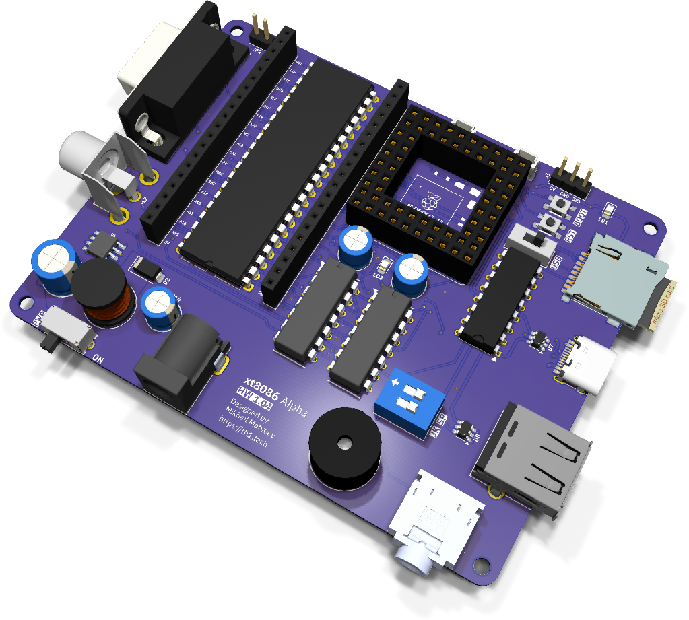 | 99.9 × 78.0 mm | Intel 8086 (minimum mode) | The earlier 8086 design: PGA2350 module, VGA and composite outputs. Superseded by the Beta. |

Dino Z80 and XT8086 Beta share an outline, mounting pattern and power/video architecture — they are the same platform with a different CPU socketed into it. XT8086 Alpha is a **separate version stream**, not an earlier revision of the Beta.

### Modules

Two add-on modules ship alongside the boards:

| Module | Render | PCB size | What it is |
|--------|:------:|----------|------------|
| [TurboSound](./hardware/turbosound) | 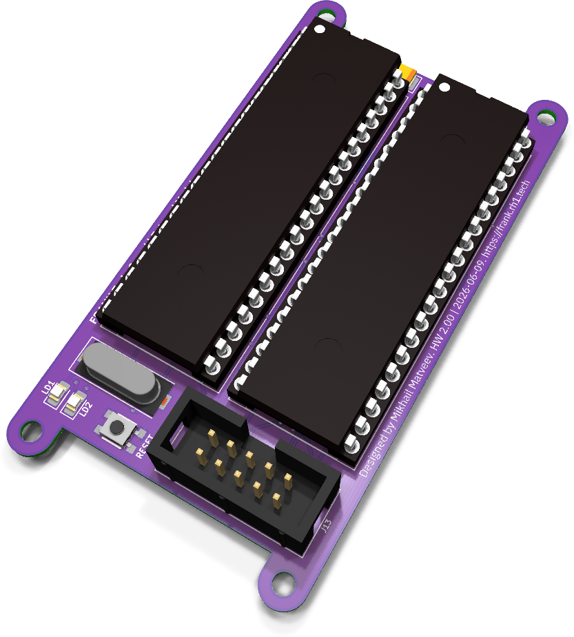 | 42 × 79.5 mm | Dual YM2149 / AY-3-8910 sound expansion (socketed DIP-40). **Currently supported only by [MiniFRANK](./docs/minifrank.md)** via its expansion header. |
| [Hecate](./hardware/hecate) | 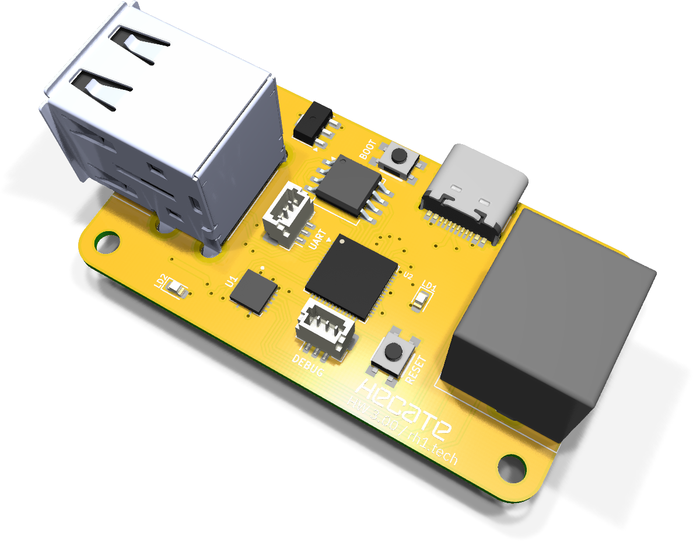 | 53 × 29 mm | Standalone RP2040 USB-to-PS/2 bridge board. Runs the [Hecate firmware](https://github.com/rh1tech/hecate); presents USB keyboards and mice as PS/2 devices. |

## Supported software

Over thirty emulators and native ports run on FRANK boards.

### Console emulators

| Firmware | Platform | Repository | PSRAM required |
|----------|----------|------------|----------------|
| frank-nes | NES / Famicom (Dendy) | [frank-nes](https://github.com/rh1tech/frank-nes) | Yes (8 MB) |
| frank-snes | SNES / Super Famicom | [frank-snes](https://github.com/rh1tech/frank-snes) | Yes (8 MB) |
| frank-genesis | Sega Genesis / Mega Drive | [frank-genesis](https://github.com/rh1tech/frank-genesis) | Yes (8 MB) |
| frank-c64 | Commodore 64 | [frank-c64](https://github.com/rh1tech/frank-c64) | Yes (8 MB) |
| frank-apple | Apple IIe | [frank-apple](https://github.com/rh1tech/frank-apple) | Optional |
| frank-msx | MSX / MSX2 / MSX2+ (fMSX core) | [frank-msx](https://github.com/rh1tech/frank-msx) | Yes (8 MB) |

### PC emulation

| Firmware | Platform | Repository | PSRAM required |
|----------|----------|------------|----------------|
| frank-386 | IBM PC i386 (DOS, Windows 3.x/95, Linux) | [frank-386](https://github.com/rh1tech/frank-386) | Yes (8 MB) |

### Game engine ports

| Firmware | Game | Repository | PSRAM required |
|----------|------|------------|----------------|
| frank-idtech1 | DOOM, Heretic, Hexen, Strife (all-in-one) | [frank-idtech1](https://github.com/rh1tech/frank-idtech1) | Yes (8 MB) |
| frank-doom | DOOM (standalone) | [frank-doom](https://github.com/rh1tech/frank-doom) | Yes (8 MB) |
| frank-heretic | Heretic | [frank-heretic](https://github.com/rh1tech/frank-heretic) | Yes (8 MB) |
| frank-wolf3d | Wolfenstein 3D | [frank-wolf3d](https://github.com/rh1tech/frank-wolf3d) | Yes (8 MB) |
| frank-duke3d | Duke Nukem 3D | [frank-duke3d](https://github.com/rh1tech/frank-duke3d) | Yes (8 MB) |
| frank-prince | Prince of Persia | [frank-prince](https://github.com/rh1tech/frank-prince) | Yes (8 MB) |
| frank-digger | Digger Remastered | [frank-digger](https://github.com/rh1tech/frank-digger) | No |
| frank-quest | ScummVM (AGI, SCI, SCUMM v1–v7, GOB, KYRA — King's Quest, Monkey Island, Day of the Tentacle, Full Throttle, Gobliiins, Kyrandia and more) | [frank-quest](https://github.com/rh1tech/frank-quest) | Yes (8 MB) |

### OS and utilities

| Firmware | Description | Repository | PSRAM required |
|----------|-------------|------------|----------------|
| frank-os | Full desktop OS (Windows 95-style GUI, apps, built-in emulators) | [frank-os](https://github.com/rh1tech/frank-os) | Yes (8 MB) |
| frank-kickstart | UF2 firmware launcher with SD card browser | [frank-kickstart](https://github.com/rh1tech/frank-kickstart) | Optional |
| frank-manul | Text-mode web browser (HTTP/HTTPS via ESP-01 WiFi) | [frank-manul](https://github.com/rh1tech/frank-manul) | Yes (8 MB) |
| frank-netcard | AT modem firmware for the ESP-01 WiFi module | [frank-netcard](https://github.com/rh1tech/frank-netcard) | No |

### Murmulator firmware

The original [Murmulator](https://murmulator.ru/) project provides additional firmware that runs on FRANK boards as well:

**ZX Spectrum cores:** ZX Spectrum 48K / 128K / +3e (tecnocat, pico-spec, frut-bat, ZX Speccy P, murmulator), ZX Elf (pico-alf).

**Other cross-platform emulators:** MS-DOS IBM PC XT 8088, BK-0010 / BK-0011M, Radio 86RK, Macintosh, Atari 800, NES / Famicom / Dendy, Sega Master System / Game Gear, NEC PC Engine / TurboGrafx-16, Nintendo GameBoy / GameBoy Color, Watara Supervision, Atari Lynx, Bandai Wonderswan / Wonderswan Color, NeoGeo Pocket Color, Gamate, Game & Watch / Elektronika.

**Tools and applications:** MurmulatorOS, Picomite MMBasic, VersaTerm, the original Murmulator bootloader.

### Other compatible boards

Most firmware also runs on:

- Murmulator (M1 and M2)
- Olimex PICO-PC (some firmware)
- Waveshare RP2350-PiZero (some firmware)

## Getting started

1. Order or fab the PCB (gerbers are in each board's `gerbers/` directory).
2. Source the components using the BOM (`hardware/<board>/docs/<rev>/bom.html`).
3. Solder following the [board-specific guide](./docs/), starting with the smallest passives and working outwards.
4. Flash firmware: hold BOOTSEL on the RP chip, plug USB, release, copy a `.uf2` file to the drive that appears (or use `picotool load`).
5. Insert an SD card with ROMs, WADs or disk images.
6. Plug in a display (HDMI or VGA), keyboard (PS/2 or USB) and gamepad.

For quick switching between firmware, flash [frank-kickstart](https://github.com/rh1tech/frank-kickstart) first. It gives you a graphical launcher that re-flashes from SD without touching BOOTSEL again.

## PSRAM

Most modern firmware (frank-os, frank-quest, frank-386, frank-genesis, frank-snes, frank-msx, frank-idtech1, frank-doom and so on) needs 8 MB of PSRAM. Some firmware refuses to boot without it: frank-quest installs a custom dlmalloc backed entirely by external PSRAM (`drivers/psram_init.c`, `drivers/dlmalloc.c`), because the runtime (heap-allocated game state, decoded resources, mixer ring buffers, font caches) does not fit in the RP2350's 520 KB of SRAM.

How you get PSRAM depends on the board:

- **FRANK Next, Core 2 and Core 2U**: 8 MB PSRAM per die, both dies on-board. Nothing to do.
- **MiniFRANK, MicroFRANK and ZeroFRANK**: PSRAM is already on-board (8 MB). Nothing to do.
- **FRANK PGA, MegaFRANK and Old Skool FRANK**: the Pimoroni PGA2350 module already includes 8 MB PSRAM. Nothing to do.
- **FRANK**: the socketed Pico 2 has no PSRAM by default. Three ways to fix this:
  1. **Pimoroni Pico Plus 2 (recommended).** A ready-made Pico 2 with 8 MB PSRAM. Drop it into the socket and you are done.
  2. **Build a [Nyx](./hardware/nyx)**, an open-source RP2350B board with integrated 16 MB flash and 8 MB PSRAM. Same form factor as Pico 2, drops straight into the socket.
  3. **Solder a PSRAM chip on top of the flash chip of an RP2350 clone.** SOP-8 flash chips are mostly only on clones (typically the black boards), not on a genuine Pico 2.

## Repo layout

```
hardware/      Board KiCad projects (frank_next, megafrank, frank_pga, frank,
               oldskool, minifrank, frank_core2, frank_core2u, microfrank,
               zerofrank, nyx), the retro-CPU boards (dino_z80, xt8086_beta,
               xt8086_alpha) plus the turbosound and hecate modules
docs/          Shared component datasheets and assembly notes
software/      Pre-built UF2s. Currently ships Hecate, the USB-to-PS/2 bridge
               firmware for FRANK's on-board RP2040-Zero. Once flashed, a USB
               keyboard or mouse appears on the hardware PS/2 lines.
               Source: https://github.com/rh1tech/hecate
```

## Documentation

Each board and module has its own assembly and usage guide:

- [FRANK Next assembly and usage guide](./docs/frank_next.md)
- [MegaFRANK assembly and usage guide](./docs/megafrank.md)
- [FRANK PGA assembly and usage guide](./docs/frank_pga.md)
- [FRANK assembly and usage guide](./docs/frank.md)
- [Old Skool FRANK assembly and usage guide](./docs/oldskool.md)
- [MiniFRANK assembly and usage guide](./docs/minifrank.md)
- [FRANK Core 2 assembly and usage guide](./docs/frank_core2.md)
- [FRANK Core 2U assembly and usage guide](./docs/frank_core2u.md)
- [MicroFRANK assembly and usage guide](./docs/microfrank.md)
- [ZeroFRANK assembly and usage guide](./docs/zerofrank.md)
- [Nyx assembly and usage guide](./docs/nyx.md)
- [Dino Z80 assembly and usage guide](./docs/dino_z80.md)
- [XT8086 Beta assembly and usage guide](./docs/xt8086_beta.md)
- [TurboSound module guide](./docs/turbosound.md)
- [Hecate (USB-to-PS/2 bridge) guide](./docs/hecate.md)

The `hardware/<board>/docs/` directories also contain auto-generated BOMs (`bom.html`) and assembly drawings (`assembly.pdf`, `schematics.pdf`) for each PCB revision.

## Links

- [rh1.tech/projects/frank](https://rh1.tech/projects/frank) — project website
- [rh1tech/frank-archive](https://github.com/rh1tech/frank-archive) — older boards and accessories
- [rh1tech/frank-lab](https://github.com/rh1tech/frank-lab) — experimental designs

### Firmware repositories

Console emulators:

- [frank-nes](https://github.com/rh1tech/frank-nes) — NES / Famicom (Dendy)
- [frank-snes](https://github.com/rh1tech/frank-snes) — SNES / Super Famicom
- [frank-genesis](https://github.com/rh1tech/frank-genesis) — Sega Genesis / Mega Drive
- [frank-c64](https://github.com/rh1tech/frank-c64) — Commodore 64
- [frank-apple](https://github.com/rh1tech/frank-apple) — Apple IIe
- [frank-msx](https://github.com/rh1tech/frank-msx) — MSX / MSX2 / MSX2+

PC emulation:

- [frank-386](https://github.com/rh1tech/frank-386) — IBM PC i386 (DOS, Windows 3.x/95, Linux)

Game engine ports:

- [frank-idtech1](https://github.com/rh1tech/frank-idtech1) — DOOM, Heretic, Hexen, Strife (all-in-one)
- [frank-doom](https://github.com/rh1tech/frank-doom) — DOOM (standalone)
- [frank-heretic](https://github.com/rh1tech/frank-heretic) — Heretic
- [frank-wolf3d](https://github.com/rh1tech/frank-wolf3d) — Wolfenstein 3D
- [frank-duke3d](https://github.com/rh1tech/frank-duke3d) — Duke Nukem 3D
- [frank-prince](https://github.com/rh1tech/frank-prince) — Prince of Persia
- [frank-digger](https://github.com/rh1tech/frank-digger) — Digger Remastered
- [frank-quest](https://github.com/rh1tech/frank-quest) — ScummVM (AGI, SCI, SCUMM, GOB, KYRA)

OS and utilities:

- [frank-os](https://github.com/rh1tech/frank-os) — Full desktop OS with built-in emulators
- [frank-kickstart](https://github.com/rh1tech/frank-kickstart) — UF2 firmware launcher
- [frank-manul](https://github.com/rh1tech/frank-manul) — Text-mode web browser
- [frank-netcard](https://github.com/rh1tech/frank-netcard) — AT modem firmware for ESP-01
- [hecate](https://github.com/rh1tech/hecate) — USB-to-PS/2 bridge for the RP2040-Zero

## Author

Mikhail Matveev — software engineer and hardware developer based in Thessaloniki, Greece. Background in software architecture, QA and open-source development. Builds retro computing hardware and writes firmware for fun. More projects at [rh1.tech](https://rh1.tech).

## License

&copy; 2026 Mikhail Matveev, <xtreme@rh1.tech>

GPL v3. See [LICENSE](./LICENSE).
