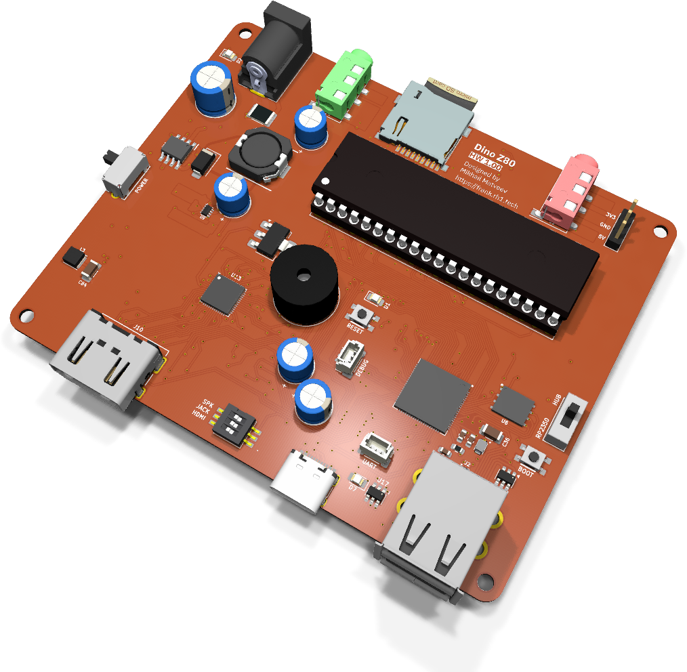
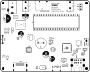
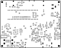

# Dino Z80: руководство по сборке и эксплуатации

  

Dino Z80 — это не эмулятор. На плате стоит настоящий Zilog Z84C0020PEC в панельке DIP-40, исполняющий реальный машинный код Z80. Расположенный рядом RP2350B не притворяется процессором — он выполняет роль чипсета: память, видео, накопитель и ввод-вывод для процессора, выпущенного в 1976 году.

Видео выходит из RP2350B как RGB с таймингами VGA и прямо на плате преобразуется в HDMI микросхемой MS9288A, поэтому современный монитор работает без переходников. Звук — исторически достоверная связка PC speaker на транзисторе с 12-миллиметровым излучателем, плюс линейный выход 3.5 мм и вход магнитофона для загрузки с кассеты. Питание подается через разъем 2.0 mm, USB-C или трехконтактную гребенку, а выбором между источниками занимаются преобразователь MP1584EN и TPS2116.

Dino использует тот же контур платы, ту же схему крепежа и ту же архитектуру питания и видео, что и [XT8086 Beta](./xt8086_beta.md): это одна платформа с разными процессорами в панельке.

- **Размер платы:** 99.50 × 80.00 mm
- **Вычислитель:** Zilog Z84C0020PEC (Z80, панелька DIP-40) + RP2350B QFN-80 в роли чипсета
- **KiCad-проект:** [`hardware/dino_z80/`](../hardware/dino_z80)
- **Gerber-файлы:** [`hardware/dino_z80/gerbers/`](../hardware/dino_z80/gerbers/)
- **BOM, схемы PDF, сборочный чертеж:** [`hardware/dino_z80/docs/`](../hardware/dino_z80/docs/)

> **Недавно перенесено из [frank-lab](https://github.com/rh1tech/frank-lab).** Перед заказом
> печатной платы изучите схему и BOM.

## Состав платы

| Подсистема | Компонент(ы) | Назначение |
|------------|--------------|------------|
| Процессор | Zilog Z84C0020PEC, панелька DIP-40 | Настоящий Z80 на 20 MHz, съемный. |
| Буфер шины | 74HCT125 | Согласование уровней на шине Z80. |
| Чипсет | RP2350B QFN-80 | Память, видео, накопитель и ввод-вывод. |
| Флеш-память | W25Q128JVPIQ | SPI-флеш 16 MB. |
| PSRAM | ESP-PSRAM64H | 8 MB PSRAM. |
| Видео | MS9288A + HDMI Type A | RGB с таймингами VGA, преобразованный в HDMI на плате. |
| Тактирование видео | 24.576 MHz + AMS1117-1.8 | Тактирование MS9288A и шина 1.8 V. |
| Звук | BC847 + излучатель 12 × 8.5 мм | PC speaker. |
| Аудиовыход | Гнездо 3.5 мм | Линейный выход. |
| Вход магнитофона | Гнездо 3.5 мм + пара BC850 | Вход с кассеты или линейный. |
| USB host | Сдвоенный USB Type-A (2 порта) | Через хаб MW7211A. |
| Коммутация USB | TS3USB221 | Мультиплексирование host. |
| Защита USB | CH217K × 2, USBLC6 × 3, предохранитель 1.5 A | Ограничение тока и защита от статики. |
| USB (нативный) | USB Type-C | Нативный USB RP2350B. |
| Накопитель | Слот MicroSD | Образы дисков и ROM-образы. |
| Вход питания | Разъем DC-005, USB-C, гребенка на 3 контакта | Три источника. |
| Питание | MP1584EN, SY8089AAAC, AMS1117-1.8 | Шины 5 V, 3.3 V и 1.8 V. |
| Коммутация питания | TPS2116 | Автоматический выбор источника. |
| Переключатели | SS12D00, SK12D07VG3NS, DIP на 3 положения | Питание, режим, конфигурация. |
| Крепеж | 4 × Ø2.7 mm | Без металлизации. |

## Спецификация (BOM, обзор)

Полный точный BOM генерируется из KiCad-проекта и публикуется в файле
[`hardware/dino_z80/docs/<rev>/bom.html`](../hardware/dino_z80/docs/). Ключевые компоненты —
это Z84C0020PEC в панельке DIP-40, RP2350B, флеш-память W25Q128, ESP-PSRAM64H, преобразователь
видео MS9288A, хаб MW7211A и импульсный преобразователь MP1584EN.

## Замечания по сборке

- Сначала припаяйте RP2350B, флеш-память, PSRAM и MS9288A — это компоненты с мелким шагом,
  им нужен фен или нагревательный столик.
- Устанавливайте **панельку DIP-40**, а не сам Z80. Процессор вставляется после того, как
  шины питания проверены.
- Проверьте шину 1.8 V до установки MS9288A. Это единственная шина, которую легко перепутать,
  а преобразователь не переживет 3.3 V.
- Разъем питания, сдвоенный USB и излучатель выступают над платой — паяйте их последними.

## Первый запуск

1. Проверьте шины 5 V, 3.3 V и 1.8 V при **пустой** панельке Z80.
2. Удерживая BOOT, подключите USB-C, отпустите кнопку и скопируйте файл `.uf2` на появившийся диск.
3. Обесточьте плату, вставьте Z80, соблюдая положение первого вывода, и включите снова.
4. Подключите дисплей HDMI.
5. Подключите USB-клавиатуру к сдвоенному порту и установите карту MicroSD.

## Совместимость прошивок

Dino Z80 работает со своей собственной прошивкой чипсета для RP2350B — это не целевая платформа
для эмуляционных прошивок FRANK, которые предполагают, что RP2350 является процессором, а не
вспомогательной микросхемой. Видео только по HDMI (через MS9288A), ввод только по USB, WiFi и
часов реального времени на плате нет.

## Шелкография

| Верх | Низ |
|:---:|:---:|
|  |  |

## Поиск и устранение неисправностей

- **Нет изображения:** MS9288A требует шины 1.8 V и тактирования 24.576 MHz. Проверьте и то,
  и другое, прежде чем подозревать RP2350B.
- **Z80 не запускается:** проверьте положение первого вывода в панельке и то, что буфер
  74HCT125 установлен и правильно ориентирован.
- **Нет ввода через USB:** сдвоенный порт подключен через хаб MW7211A — проверьте хаб,
  ограничители CH217K и предохранитель на 1.5 A.
- **Плата не питается от разъема DC:** выбором источника занимается TPS2116; убедитесь, что
  полярность «плюс в центре» и предохранитель цел.
