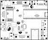
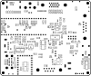

# FRANK assembly and usage guide

  

FRANK is the socketed full-size board. It uses a Raspberry Pi Pico (or Pico 2) in a socket as the main compute module, so you can swap the brain at will — handy when you want to try Pico 2, Pico Plus 2 (with PSRAM), a Nyx 2, or any other Pico-pinout module on the same PCB. On top of the standard hardware PS/2 port, an extra RP2040-Zero on-board lets you plug in a USB keyboard or mouse and have it appear as a PS/2 device — so you can use either input type without swapping firmware. Components are 0805, so you can hand-solder the whole board with a basic iron and decent flux.

If you want everything fixed on a single PCB instead, the flagship [FRANK PGA](./frank_pga.md) is the same outline with a soldered-on PGA2350 module, native USB host and ESD protection.

- **PCB size:** 99.5 × 83.1 mm
- **KiCad project:** [`hardware/frank/`](../hardware/frank)
- **Gerbers:** [`hardware/frank/gerbers/`](../hardware/frank/gerbers/)
- **BOM, schematics PDF, assembly drawing:** [`hardware/frank/docs/`](../hardware/frank/docs/)

## What's on the board

| Subsystem | Component(s) | Purpose |
|-----------|--------------|---------|
| Compute | Raspberry Pi Pico / Pico 2 (socket) | Main MCU. Runs the firmware. |
| Helper MCU | RP2040-Zero | Bridges USB keyboards and mice into the hardware PS/2 lines, so the same port can speak either protocol. This is in addition to the dedicated PS/2 mini-DIN connector. |
| Power | MP1584EN buck regulator | 5–28 V DC input → 5 V rail |
| Power | AMS1117-3.3 | 5 V → 3.3 V LDO for the ESP-01S and other 3.3 V parts |
| Video | HDMI (Type A) | Primary video output |
| Video | VGA (DE-15) | Secondary video output |
| Video | RCA composite | Soft composite output |
| Video | TFT display header | For small parallel TFT panels (display.kicad_sch) |
| Audio out | 3.5 mm jack (PJ-320D) | Line-level audio |
| Audio amp | PAM8403D | Speaker driver with two PAM headers |
| Audio DAC | TDA1387T | I2S-style DAC for cleaner audio |
| Audio routing | 74HC4052D + LM358 + CD4069UBM | Audio multiplexer and PWM filter |
| Tape | 3.5 mm jack (PJ-320D) | Cassette load input for ZX Spectrum and similar |
| Storage | MicroSD slot (104031-0811) | ROMs, WADs, disk images |
| Keyboard | PS/2 (DC3RX19JA2 mini-DIN) | Hardware PS/2 keyboard / mouse |
| Keyboard / mouse | USB Type-A stacked (USB4215) | Two stacked USB host ports, behind an MW7211A hub. USB devices can also be presented to the firmware as PS/2 via the RP2040-Zero. |
| Gamepad | 2 × DB9 (104031-0811) | Famicom-compatible controllers |
| Network | ESP-01S header | Optional WiFi via the Murmulator AT firmware |
| Level shifting | TXS0104EDR | 3.3 V ↔ 5 V for SD card and other 5 V signals |
| Configuration | DIP switches | Select video / audio routing options |

## Bill of materials (high-level)

The full pick-and-place BOM is in `bom.html`. Here is a summary by part class so you can pre-source before assembly.

### Active parts

| Ref | Part | Qty | Notes |
|-----------------|------|-----|-------|
| U | Raspberry Pi Pico / Pico 2 | 1 | Socketed, not soldered. Use Pico Plus 2 for built-in PSRAM. |
| U | RP2040-Zero module | 1 | Soldered as a daughterboard. Handles USB→PS/2. |
| U | TDA1387T | 1 | DIP-8 audio DAC |
| U | PAM8403D | 1 | SOP-16 speaker amp |
| U | LM358 | 1 | SOIC-8 op-amp (audio path) |
| U | CD4069UBM | 1 | SOIC-14 hex inverter (PWM filter) |
| U | 74HC4052D | 1 | SOIC-16 analog multiplexer |
| U | TXS0104EDR | 1 | SOIC-14 level shifter |
| U | MP1584EN-LF-Z | 1 | SOIC-8 buck converter |
| U | AMS1117-3.3 | 1 | SOT-223 LDO |
| U | MW7211A | 1 | SOIC-16 USB 2.0 hub controller |
| U | ESP-01v090 module | 1 | Socketed; 4-pin row header |

### Passives

| Reference style | Value | Qty (rounded) | Footprint |
|-----------------|-------|---------------|-----------|
| C | 100 nF | 16 | 0805 |
| C | 10 µF | 13 | 0805 |
| C | 1 µF / 4.7 µF / 47 nF / 150 pF | mixed | 0805 |
| C | 100 µF / 220 µF / 680 µF | bulk | through-hole electrolytic |
| R | 10 kΩ | 16 | 0805 |
| R | 270 Ω | 14 | 0805 (resistor DACs) |
| R | 2 kΩ / 1 kΩ / 100 kΩ / 100 Ω / 150 Ω | mixed | 0805 |
| L | 22 µH | 1 | Power inductor (buck) |
| L | 330 Ω ferrite bead | 1 | 0805 |
| D | 1N5819WS, 1N5822 | 2 | Schottky |
| D | LED 3V3 | 1 | Power indicator |

### Connectors and mechanical

| Part | Qty | Purpose |
|------|-----|---------|
| DC-005-5A-2.0 | 1 | 5.5 × 2.0 mm DC barrel jack |
| Slide switch SK12D07VG3NS | 1 | Power |
| RCA-103 | 1 | Composite video |
| VGA HD15 | 1 | VGA output |
| HDMI Type A | 1 | HDMI output |
| PJ-320D | 2 | Audio out + tape in (3.5 mm jacks) |
| USB4215-03-A | 1 | Stacked USB Type-A (host) |
| 104031-0811 | 1 | MicroSD slot |
| DC3RX19JA2 | 1 | PS/2 mini-DIN |
| DB9 (right-angle) | 2 | Gamepad ports |
| Mounting holes 2.7 mm | 4 | M2.5 / M3 |

## Suggested soldering order

Component placement and silkscreen labels for both sides:

| Top | Bottom |
|:---:|:------:|
|  |  |

Work from the smallest, hardest-to-access components outwards, so larger parts don't block your iron later.

1. **Surface-mount ICs**, smallest first.
   - TXS0104EDR, 74HC4052D, CD4069UBM, LM358, PAM8403D
   - MW7211A USB hub
   - MP1584EN buck, AMS1117 LDO
   - TDA1387T (DIP-8 — solder this from the top, or socket it)
2. **0805 resistors and ceramic capacitors.** Tweezers, flux, drag-soldering or hot air. Orientation does not matter for these (they are non-polarised), but match values to silkscreen.
3. **Diodes (1N5819WS, 1N5822) and the power LED.** Watch polarity (cathode = stripe).
4. **Power inductor (22 µH)** and any ferrite beads.
5. **Bulk electrolytics** (100, 220, 680 µF). Polarity matters. The longer leg is positive.
6. **Through-hole connectors:**
   - DC barrel jack
   - Slide switch
   - 3.5 mm jacks (audio + tape)
   - RCA composite jack
   - HDMI Type A
   - VGA DE-15
   - MicroSD slot
   - PS/2 mini-DIN
   - USB Type-A stacked
   - DB9 gamepad connectors (×2)
7. **Pin headers and sockets:**
   - Pico / Pico 2 socket (40-pin, 2 × 20-pin female)
   - RP2040-Zero footprint (you can solder it directly or use headers)
   - ESP-01S 2 × 4 socket
   - TFT display header (only if you plan to use a TFT)
   - DIP switches and any jumpers
8. **DAC and audio amp** if you skipped them in step 1 (some builders prefer to socket the TDA1387T).
9. **Mounting hardware:** M2.5 stand-offs through the 2.7 mm holes if you are putting it in a case.

After soldering, before plugging anything in:

- Visual inspection under magnification.
- Continuity-test the 5 V and 3.3 V rails for shorts to ground.
- Apply 5 V from the bench supply with current limit at ~150 mA. With no Pico installed, draw should sit well under that.

## First boot

1. Plug a Raspberry Pi Pico or Pico 2 into the socket. **Mind the orientation** — the silkscreen shows the USB end.
2. Connect HDMI or VGA to a display.
3. Connect a PS/2 or USB keyboard.
4. Insert a FAT32 SD card with firmware (or hold BOOTSEL and copy a `.uf2` directly to the Pico).
5. Power on with the slide switch.

If the screen stays dark:

- Check the DIP switches against the schematic for the video routing you want (HDMI / VGA / composite).
- Confirm the firmware UF2 matches your Pico (RP2040 vs RP2350) and the M2 layout.

## Connecting PSRAM

Most modern firmware (frank-os, frank-quest, frank-386, frank-snes, frank-msx, the DOOM family and so on) needs 8 MB of PSRAM. Some firmware will not boot without it — frank-quest, for example, runs its entire heap out of PSRAM via a custom dlmalloc.

There are three ways to get a PSRAM-equipped Pico 2 into the FRANK socket:

1. **Pimoroni Pico Plus 2 (recommended).** A ready-made Pico 2 with 8 MB PSRAM. Drop it into the socket and you are done.
2. **Solder a PSRAM chip on top of the flash chip of an RP2350 clone.** SOP-8 flash chips are mostly only on clones (typically black boards), not the original Pico 2 — you cannot do this trick on a genuine Pico 2. See the [Murmulator PSRAM guide](https://murmulator.tilda.ws/) for the connection pattern.
3. **Build a Nyx 2** — a DIY RP2350 board with integrated PSRAM.

## Troubleshooting

| Symptom | Likely cause |
|---------|--------------|
| No video on any output | Wrong firmware (M1 instead of M2), Pico not seated, DIP switches set to a disabled output. |
| HDMI works but VGA does not | DIP switches routed to HDMI only; or the resistor DAC values on the VGA path are wrong. Double-check the 14× 270 Ω resistors. |
| Hardware PS/2 keyboard ignored | Wrong PS/2 protocol mode (AT vs XT) or the TXS0104 level shifter is not soldered. |
| USB keyboard not seen as PS/2 | The RP2040-Zero is not flashed with the USB-to-PS/2 firmware. Flash [usb2ps2 firmware](https://github.com/rh1tech/frank-archive) onto it. The hardware PS/2 port keeps working regardless. |
| No audio | TDA1387T orientation, or audio multiplexer DIP switch routed to a disabled path. |
| Board reboots under load | Buck regulator drawing too much current, or input voltage too low. Use 9 V / 1 A or higher. |
| USB hub fails to enumerate | MW7211A solder bridges; reflow the SOIC-16. |

