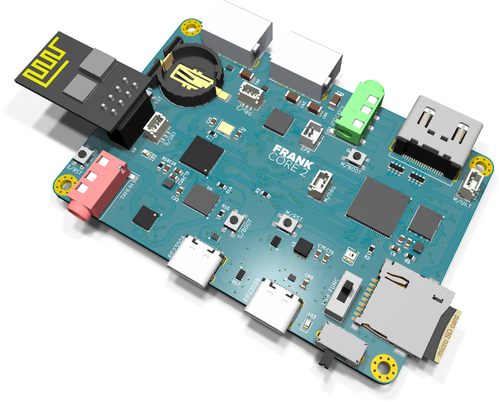
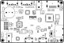
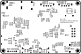

# FRANK Core 2 assembly and usage guide

  

FRANK Core 2 is [FRANK Next](./frank_next.md) shrunk to fit. It keeps the dual-RP2350 architecture — an RP2350B master and an RP2350A slave, each with 16 MB flash and 8 MB PSRAM — along with the TLV320DAC3100 codec, the DS3231MZ real-time clock and the CH334F USB hub. Everything that made the board wider is gone.

The trades against FRANK Next are three: WiFi is an ESP-01 module socket rather than a soldered ESP8266EX, there are two USB Type-A host ports instead of three, and there is no CH343P USB-serial bridge. In exchange the outline drops from 99.00 mm to 80.56 mm wide at the same 53.98 mm height, so it fits enclosures that the flagship will not.

- **PCB size:** 80.56 × 53.98 mm
- **Compute:** RP2350B QFN-80 (master) + RP2350A QFN-60 (slave), both on-board
- **KiCad project:** [`hardware/frank_core2/`](../hardware/frank_core2)
- **Gerbers:** [`hardware/frank_core2/gerbers/`](../hardware/frank_core2/gerbers/)
- **BOM, schematics PDF, assembly drawing:** [`hardware/frank_core2/docs/`](../hardware/frank_core2/docs/)

> **Recently promoted from [frank-lab](https://github.com/rh1tech/frank-lab).** Review the
> schematic and BOM before ordering a PCB.

## What's on the board

| Subsystem | Component(s) | Purpose |
|-----------|--------------|---------|
| Compute (master) | RP2350B QFN-80 | Main emulation core |
| Compute (slave) | RP2350A QFN-60 | USB host, audio and housekeeping |
| Flash | W25Q128 × 2 | 16 MB per die |
| PSRAM | APS6404L × 2 | 8 MB per die |
| WiFi | ESP-01 module socket | Socketed ESP-01 / ESP-01S |
| Video | HDMI Type A | HDMI out (HDMI only) |
| USB host | 2 × USB Type-A behind CH334F hub | Keyboards, mice, gamepads |
| USB routing | TS3USB221 | Host / device multiplexing |
| USB protection | CH217K × 2, TPD4S012 × 4 | Current limit and ESD |
| USB (native) | USB Type-C × 2 | Native USB for each die |
| Audio | TLV320DAC3100 | I²S codec, line out plus speaker amp |
| Audio out | 3.5 mm jack, JST-GH 2-pin | Line level and speaker |
| Tape in | 3.5 mm jack + BC850 pair | Cassette / audio input |
| Clock | DS3231MZ + CR1220 | Battery-backed real-time clock |
| Storage | MicroSD slot | ROMs, WADs, disk images |
| Power | USB-C, SY8089AAAC buck, XC6206P182 | 5 V in, 3.3 V and 1.8 V rails |
| Power path | TPS2116, AO3401A | Source selection and reverse protection |
| Indicator | WS2812B-2020 | Addressable status LED |
| Switches | SS12D00, SK12D07VG3NS | Power and mode |
| Mounting | 4 × Ø2.5 mm plated | Plated and stitched |

## Bill of materials (high-level)

The full, exact BOM is generated from the KiCad project and published as
[`hardware/frank_core2/docs/<rev>/bom.html`](../hardware/frank_core2/docs/). The headline
parts are the RP2350B and RP2350A, two W25Q128 flash chips, two APS6404L PSRAM chips, the
CH334F hub, the TLV320DAC3100 codec and the DS3231MZ RTC.

## Assembly notes

- Both QFN packages need hot air or a hot plate. Solder the RP2350B, RP2350A, flash and PSRAM
  first, then the regulators, then the connectors.
- 0603 passives dominate; a microscope or magnifier helps.
- The ESP-01 socket is through-hole — fit it last so it does not block access to the QFNs.
- The board is 4-layer. Check for shorts between the 3.3 V, 1.8 V and ground planes before
  first power-up.

## First boot

1. Hold BOOT on the master, connect its USB-C, release, and copy a `.uf2` to the drive that
   appears (or use `picotool load`).
2. Flash the slave the same way through its own USB-C.
3. Connect an HDMI display.
4. Plug a USB keyboard into either Type-A port.
5. Insert a MicroSD card with ROMs or disk images.

## Firmware compatibility

Core 2 has the same memory as FRANK Next — 16 MB flash and 8 MB PSRAM per die — so every
PSRAM-requiring firmware runs. Builds targeting FRANK Next work here with two caveats: there
is no CH343P serial console, and WiFi firmware must talk to a socketed ESP-01 rather than the
on-board ESP8266EX. Video is HDMI only; input is USB only.

## Silkscreen

| Top | Bottom |
|:---:|:---:|
|  |  |

## Troubleshooting

- **No video:** confirm the firmware targets HDMI. Core 2 has no VGA output.
- **Only one die enumerates:** each RP2350 has its own USB-C. Check you are on the right port
  and that both flash chips are soldered cleanly.
- **No WiFi:** seat the ESP-01 module the right way round and confirm its 3.3 V rail.
- **No USB input:** both Type-A ports sit behind the CH334F hub — verify the hub and the
  CH217K current limiters.
- **Clock resets:** fit the CR1220 cell; the DS3231MZ keeps time only while it is backed up.
