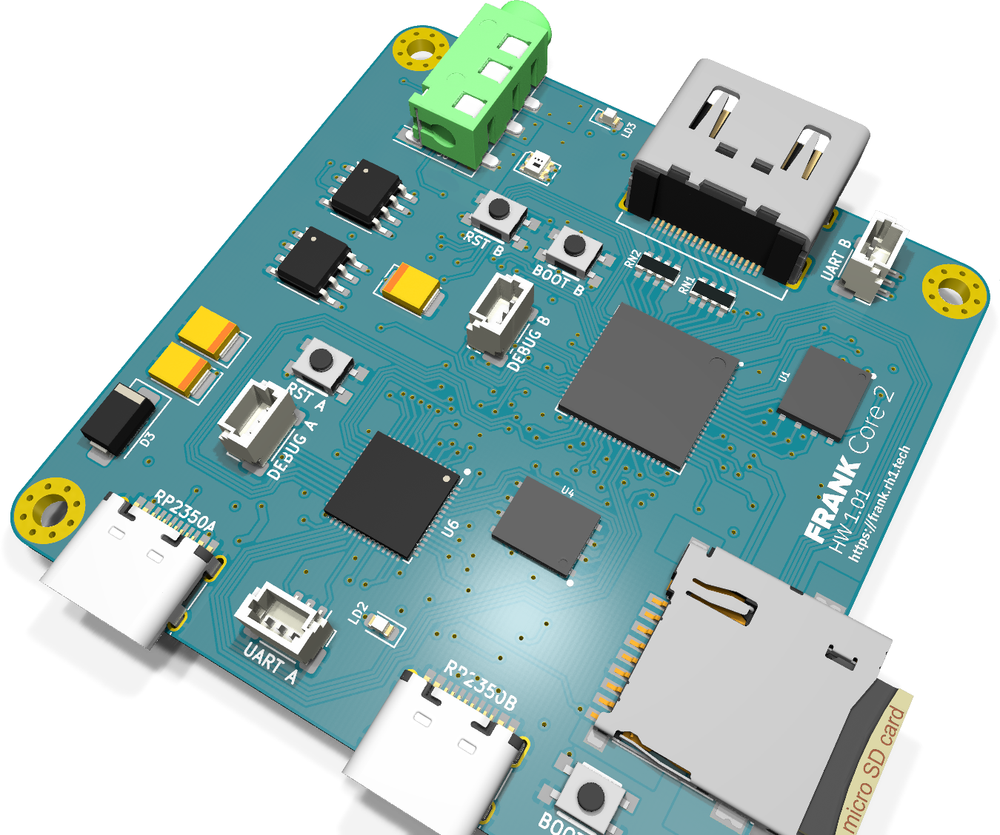
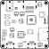
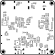

# FRANK Core 2 Proto: руководство по сборке и эксплуатации

  

FRANK Core 2 Proto — отладочная плата того поколения двухкристальной подсистемы, которое затем вышло как [Core 2U](./frank_core2u.md). Это квадратная четырехслойная плата 55 × 55 mm с мастером RP2350B и слейвом RP2350A; у каждого кристалла своя флеш-память 16 MB, своя PSRAM 8 MB, свой генератор 12 MHz и свой USB-C — и ничего сверх видео, звука и накопителя.

Проще всего считать ее платой Core 2U, у которой отрезали правые 12 mm. Core 2U добавляет хаб MW7211A, два порта USB Type-A, мультиплексор host TS3USB221, вход магнитофона на CD4069 и переключатель питания; все остальное — два кристалла, память ESP-PSRAM64H, генераторы ASE, звуковой тракт TDA1387T с LM358, шина на AMS1117-3.3 — здесь то же самое. **USB host, WiFi, часов реального времени и выключателя питания на этой плате нет:** она включается сразу при подключении USB-C.

- **Размер платы:** 55.00 × 55.00 mm, 4 слоя
- **Вычислитель:** RP2350B QFN-80 (мастер) + RP2350A QFN-60 (слейв), оба распаяны на плате
- **Число компонентов:** 133 установки
- **KiCad-проект:** [`hardware/frank_core2_proto/`](../hardware/frank_core2_proto)
- **Gerber-файлы:** [`hardware/frank_core2_proto/gerbers/`](../hardware/frank_core2_proto/gerbers/)
- **BOM, схемы PDF, сборочный чертеж:** [`hardware/frank_core2_proto/docs/`](../hardware/frank_core2_proto/docs/)

> **Это прототип.** Он опубликован потому, что нагляднее и компактнее всего показывает
> топологию с двумя RP2350, а не потому, что его стоит собирать для повседневного
> использования. Для рабочей машины собирайте [Core 2U](./frank_core2u.md).

> **Недавно перенесено из [frank-lab](https://github.com/rh1tech/frank-lab).** Перед заказом
> печатной платы изучите схему и BOM.

## Состав платы

| Подсистема | Компонент(ы) | Назначение |
|------------|--------------|------------|
| Вычислитель (мастер) | RP2350B QFN-80 | Основное ядро эмуляции. |
| Вычислитель (слейв) | RP2350A QFN-60 | Звук и служебные задачи. |
| Флеш-память | W25Q128JVPIQ × 2 | По 16 MB на кристалл. |
| PSRAM | ESP-PSRAM64H × 2 (SO-8) | По 8 MB на кристалл. |
| Тактирование | Генераторы ASE-12 MHz × 2 | По одному на кристалл. |
| Видео | HDMI Type A DC3RX19JA2 + 2 × R_Pack04 270 Ω | Выход HDMI с согласующими резисторами. |
| Аудиовыход | TDA1387T + LM358 + гнездо PJ-320D 3.5 мм | Дискретный I²S-ЦАП с буфером. |
| Накопитель | Слот MicroSD 104031-0811 | ROM-образы, WAD-файлы, образы дисков. |
| USB | USB Type-C USB4215-03-A × 2 | Нативный USB, по одному на кристалл. |
| Защита USB | USBLC6-2SC6 × 2 | Защита от статики. |
| Питание | AMS1117-3.3, SS34, 1N5819WS × 2 | Вход 5 V, шина 3.3 V на LDO. |
| Индикация | WS2812B-2020 + светодиоды 0603 зеленый и синий | Адресный индикатор и два дискретных. |
| Кнопки | 4 × боковые тактовые KMR221G | Загрузка и сброс, по паре на кристалл. |
| Крепеж | 4 × Ø2.5 mm, металлизированные | Металлизированные, со сшивкой. |

## Спецификация (BOM, обзор)

Полный точный BOM генерируется из KiCad-проекта и публикуется в файле
[`hardware/frank_core2_proto/docs/<rev>/bom.html`](../hardware/frank_core2_proto/docs/).
Из 133 установок 53 — конденсаторы и 38 — резисторы; ключевые компоненты — это RP2350B и
RP2350A, две микросхемы флеш-памяти W25Q128JVPIQ, две микросхемы ESP-PSRAM64H, ЦАП TDA1387T
с буфером LM358 и стабилизатор AMS1117-3.3.

## Замечания по сборке

- Оба корпуса QFN требуют фена или нагревательного столика. Сначала припаяйте RP2350B, RP2350A,
  флеш-память и PSRAM, затем стабилизатор, затем разъемы.
- AMS1117-3.3 — линейный стабилизатор, а не импульсный преобразователь. Он будет заметно
  греться, поэтому не экономьте на полигоне земли под ним.
- Четыре тактовые кнопки KMR221G — боковые, они стоят по краю платы и их легко припаять с
  перекосом. Прихватите один вывод, проверьте положение и только потом паяйте остальные.
- RN1 и RN2 — это резисторные сборки 4 × 0603 на линиях HDMI. Их легко принять за один крупный
  пассивный компонент — сверяйтесь с шелкографией.
- Выключателя питания нет. Все, что подключено, оказывается под напряжением сразу после
  подключения USB-C.

## Первый запуск

1. Удерживая BOOT на мастере (S1), подключите его USB-C, отпустите кнопку и скопируйте файл
   `.uf2` на появившийся диск (или используйте `picotool load`).
2. Тем же способом прошейте слейв через его собственный USB-C, используя для BOOT кнопку S3.
3. Подключите дисплей HDMI.
4. Установите карту MicroSD с ROM-образами или образами дисков.

Порта USB host здесь нет, поэтому ввод с клавиатуры возможен только через те интерфейсы,
которые поддерживает прошивка. Именно поэтому плата остается прототипом, а не повседневной
машиной.

## Совместимость прошивок

На Core 2 Proto 16 MB флеш-памяти и 8 MB PSRAM на кристалл, поэтому прошивки, требующие
PSRAM, работают, а звуковой тракт — тот же дискретный I²S-ЦАП TDA1387T, что и на Core 2U.
Чего прошивка не должна ожидать — это USB host, WiFi и часов реального времени: ничего из
этого здесь не установлено. Видео только по HDMI.

## Шелкография

| Верх | Низ |
|:---:|:---:|
|  |  |

## Поиск и устранение неисправностей

- **Нет изображения:** убедитесь, что прошивка рассчитана на HDMI, и проверьте RN1/RN2 —
  отсутствующая или криво припаянная сборка убивает линк без каких-либо других симптомов.
- **Плата сильно греется:** AMS1117 — линейный стабилизатор, понижающий 5 V до 3.3 V. Теплый
  корпус — это нормально; если до него нельзя дотронуться, ищите замыкание на шине 3.3 V.
- **Нет звука:** звук идет через дискретную связку TDA1387T + LM358 — проверьте обе микросхемы
  и разводку гнезда PJ-320D.
- **Определяется только один кристалл:** у каждого кристалла свой USB-C и своя пара
  BOOT/RESET. Убедитесь, что используете разъем, относящийся к нужному кристаллу.
- **Ожидаются USB-клавиатуры, WiFi или часы:** ничего из этого здесь нет. Используйте
  [Core 2U](./frank_core2u.md) или [FRANK Next](./frank_next.md).
