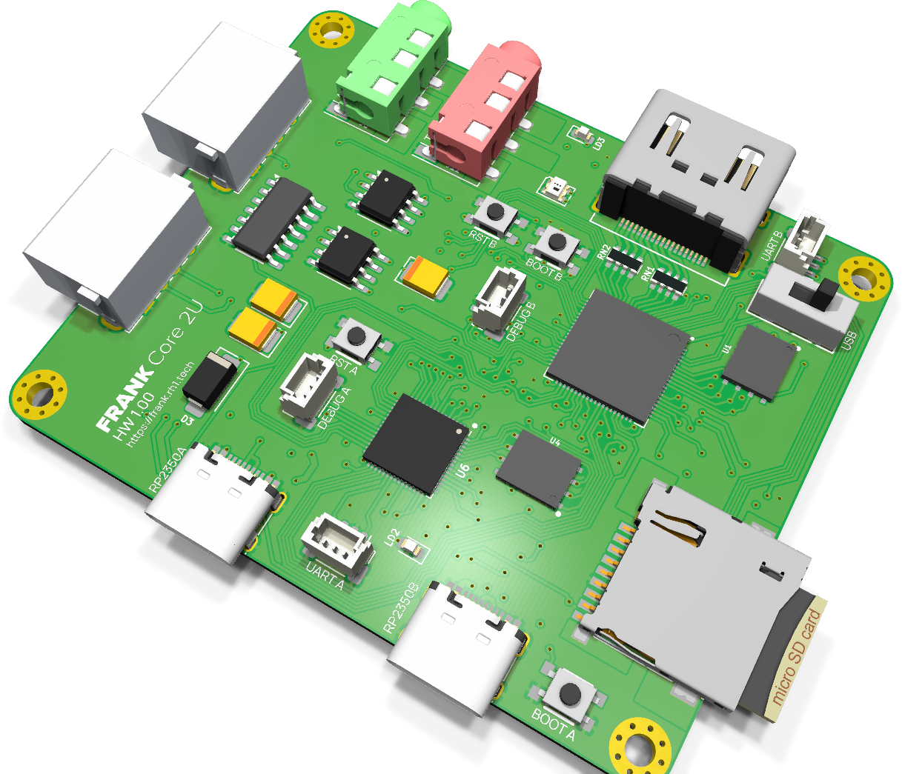
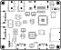
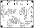

# FRANK Core 2U assembly and usage guide

  

FRANK Core 2U is the smallest dual-RP2350 board. It keeps the two-die architecture — an RP2350B master and an RP2350A slave, each with 16 MB flash and 8 MB PSRAM — in a 67 × 55 mm outline, and strips the board back to video, sound, storage and USB.

It is the production form of [Core 2 Proto](./frank_core2_proto.md), which carries the same two dies, the same ESP-PSRAM64H memory, the same ASE oscillators and the same TDA1387T audio chain on a square 55 × 55 mm outline. Core 2U adds 12 mm of width and spends all of it on host connectivity: the MW7211A hub, two USB Type-A ports, the TS3USB221 multiplexer, a tape input and a power switch. Compared with [FRANK Next](./frank_next.md) this is a different and simpler subsystem generation — a plain AMS1117-3.3 rather than a switching buck, and a discrete DAC rather than a codec. There is **no WiFi and no real-time clock** on this board.

- **PCB size:** 67.00 × 55.00 mm
- **Compute:** RP2350B QFN-80 (master) + RP2350A QFN-60 (slave), both on-board
- **KiCad project:** [`hardware/frank_core2u/`](../hardware/frank_core2u)
- **Gerbers:** [`hardware/frank_core2u/gerbers/`](../hardware/frank_core2u/gerbers/)
- **BOM, schematics PDF, assembly drawing:** [`hardware/frank_core2u/docs/`](../hardware/frank_core2u/docs/)

> **Recently promoted from [frank-lab](https://github.com/rh1tech/frank-lab).** Review the
> schematic and BOM before ordering a PCB.

## What's on the board

| Subsystem | Component(s) | Purpose |
|-----------|--------------|---------|
| Compute (master) | RP2350B QFN-80 | Main emulation core |
| Compute (slave) | RP2350A QFN-60 | USB host, audio and housekeeping |
| Flash | W25Q128 × 2 | 16 MB per die |
| PSRAM | ESP-PSRAM64H × 2 (SO-8) | 8 MB per die |
| Clock source | ASE-12 MHz oscillators | One per die |
| Video | HDMI Type A | HDMI out (HDMI only) |
| USB host | 2 × USB Type-A behind MW7211A hub | Keyboards, mice, gamepads |
| USB routing | TS3USB221 | Host / device multiplexing |
| USB protection | USBLC6 × 2 | ESD |
| USB (native) | USB Type-C × 2 | Native USB for each die |
| Audio out | TDA1387T + LM358 + 3.5 mm jack | Discrete I²S DAC and buffer |
| Tape in | 3.5 mm jack + CD4069UBM | Cassette / audio input |
| Storage | MicroSD slot | ROMs, WADs, disk images |
| Power | USB-C, AMS1117-3.3 (SOT-89), SS34 | 5 V in, 3.3 V LDO rail |
| Indicator | WS2812B-2020 | Addressable status LED |
| Switches | SS12D00 slide, KMR2 side tactiles | Power, boot, reset |
| Mounting | 4 × Ø2.5 mm plated | Plated and stitched |

## Bill of materials (high-level)

The full, exact BOM is generated from the KiCad project and published as
[`hardware/frank_core2u/docs/<rev>/bom.html`](../hardware/frank_core2u/docs/). The headline
parts are the RP2350B and RP2350A, two W25Q128 flash chips, two ESP-PSRAM64H chips, the
MW7211A hub, the TDA1387T DAC with its LM358 buffer and the AMS1117-3.3 regulator.

## Assembly notes

- Both QFN packages need hot air or a hot plate. Solder the RP2350B, RP2350A, flash and PSRAM
  first, then the regulator, then the connectors.
- The AMS1117-3.3 is an LDO, not a buck. It will run warm — do not skip its ground pour.
- The tactile switches are KMR2 side-actuated parts; they sit on the board edge and are easy
  to fit crooked. Tack one pad, check alignment, then solder the rest.
- 0603 passives dominate; a microscope or magnifier helps.

## First boot

1. Hold BOOT on the master, connect its USB-C, release, and copy a `.uf2` to the drive that
   appears (or use `picotool load`).
2. Flash the slave the same way through its own USB-C.
3. Connect an HDMI display.
4. Plug a USB keyboard into either Type-A port.
5. Insert a MicroSD card with ROMs or disk images.

## Firmware compatibility

Core 2U has 16 MB flash and 8 MB PSRAM per die, so PSRAM-requiring firmware runs. Compared
with FRANK Next, firmware must not expect WiFi or a real-time clock — neither is
fitted — and audio is a discrete TDA1387T I²S DAC rather than a TLV320DAC3100 codec, so the
audio driver differs. Video is HDMI only; input is USB only.

## Silkscreen

| Top | Bottom |
|:---:|:---:|
|  |  |

## Troubleshooting

- **No video:** confirm the firmware targets HDMI. Core 2U has no VGA output.
- **Board runs hot:** the AMS1117 is a linear regulator dropping 5 V to 3.3 V. Warm is normal;
  too hot to touch means check for a short on the 3.3 V rail.
- **No audio:** audio is the discrete TDA1387T + LM358 chain — check both and the jack wiring.
- **Expecting WiFi or an RTC:** neither is fitted on this board. Use [FRANK Next](./frank_next.md).
