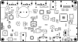
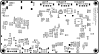

# FRANK Next assembly and usage guide

  

FRANK Next is the flagship. It is the first FRANK board with **two RP2350 dies on one PCB**: an RP2350B QFN-80 as the master and an RP2350A QFN-60 as the slave, each with its own 16 MB flash and 8 MB PSRAM. The slave takes over the work that used to steal cycles from a single core — USB host handling, audio, housekeeping — so the master can spend its time on emulation.

WiFi is no longer a socketed module. An ESP8266EX is soldered to the board with its own flash, 26 MHz crystal and a shielded 2.4 GHz antenna, multiplexed onto either RP2350 through a 74HC4052. A CH343P gives you a real USB-serial console without an external adapter. Three USB Type-A host ports sit behind a CH334F hub, each current-limited and ESD-protected. Video is HDMI only — no VGA, no composite, no PS/2, no DB9.

- **PCB size:** 99.00 × 53.98 mm
- **Compute:** RP2350B QFN-80 (master) + RP2350A QFN-60 (slave), both on-board
- **KiCad project:** [`hardware/frank_next/`](../hardware/frank_next)
- **Gerbers:** [`hardware/frank_next/gerbers/`](../hardware/frank_next/gerbers/)
- **BOM, schematics PDF, assembly drawing:** [`hardware/frank_next/docs/`](../hardware/frank_next/docs/)

> **Recently promoted from [frank-lab](https://github.com/rh1tech/frank-lab).** Review the
> schematic and BOM before ordering a PCB.

## What's on the board

| Subsystem | Component(s) | Purpose |
|-----------|--------------|---------|
| Compute (master) | RP2350B QFN-80 | Main emulation core |
| Compute (slave) | RP2350A QFN-60 | USB host, audio and housekeeping |
| Flash | W25Q128 × 2 | 16 MB per die |
| PSRAM | APS6404L × 2 | 8 MB per die |
| WiFi | ESP8266EX + W25Q16 + 26 MHz + chip antenna | On-board WiFi, no module socket |
| WiFi routing | 74HC4052 | Multiplexes the ESP onto either RP2350 |
| USB serial | CH343P | USB-to-UART console |
| Video | HDMI Type A | HDMI out (HDMI only) |
| USB host | 3 × USB Type-A behind CH334F hub | Keyboards, mice, gamepads |
| USB protection | CH217K × 3, TPD4S012 × 5 | Per-port current limit and ESD |
| USB (native) | USB Type-C × 2 | Native USB for each die |
| Audio | TLV320DAC3100 | I²S codec, line out plus speaker amp |
| Audio out | 3.5 mm jack, JST-GH 2-pin | Line level and speaker |
| Tape in | 3.5 mm jack + BC850 pair | Cassette / audio input |
| Clock | DS3231MZ + CR1220 | Battery-backed real-time clock |
| Storage | MicroSD slot | ROMs, WADs, disk images |
| Power | USB-C, SY8089AAAC buck, XC6206P182 | 5 V in, 3.3 V and 1.8 V rails |
| Power path | TPS2116, AO3401A | Source selection and reverse protection |
| Indicator | WS2812B-2020 | Addressable status LED |
| Switches | SS12D00, SK12D07VG3NS, 2-pos DIP | Power, mode, configuration |
| Mounting | 4 × Ø2.5 mm plated | Plated and stitched |

## Bill of materials (high-level)

The full, exact BOM is generated from the KiCad project and published as
[`hardware/frank_next/docs/<rev>/bom.html`](../hardware/frank_next/docs/). The headline parts
are the RP2350B and RP2350A, two W25Q128 flash chips, two APS6404L PSRAM chips, the ESP8266EX
with its W25Q16, the CH343P, the CH334F hub, the TLV320DAC3100 codec and the DS3231MZ RTC.

## Assembly notes

- Two QFN packages and the ESP8266EX all need hot air or a hot plate. Solder the RP2350B,
  RP2350A, ESP8266EX, flash and PSRAM first, then the regulators, then everything else.
- Keep the 2.4 GHz antenna keep-out clear — no copper, no components, no case screws.
- 0603 passives dominate; a microscope or magnifier helps.
- The board is 4-layer. Check for shorts between the 3.3 V, 1.8 V and ground planes before
  first power-up.

## First boot

1. Hold BOOT on the master, connect its USB-C, release, and copy a `.uf2` to the drive that
   appears (or use `picotool load`).
2. Flash the slave the same way through its own USB-C.
3. Connect an HDMI display.
4. Plug a USB keyboard into any of the three Type-A ports.
5. Insert a MicroSD card with ROMs or disk images.

## Firmware compatibility

FRANK Next has 16 MB flash and 8 MB PSRAM per die, so every PSRAM-requiring firmware runs
without extra modules. The dual-die split is new, so firmware needs to be built for it — a
single-core build will run on the master and simply leave the slave idle. Video is HDMI only,
and input is USB only: there is no VGA, composite, hardware PS/2 or DB9 gamepad port.

## Silkscreen

| Top | Bottom |
|:---:|:---:|
|  |  |

## Troubleshooting

- **No video:** confirm the firmware targets HDMI. FRANK Next has no VGA output.
- **Only one die enumerates:** each RP2350 has its own USB-C. Check you are plugged into the
  right one, and that both flash chips are soldered cleanly.
- **No WiFi:** the ESP8266EX is on-board, not socketed. Check the 74HC4052 multiplexer routing
  and that the antenna keep-out is clear.
- **No USB input:** all three Type-A ports sit behind the CH334F hub — verify the hub and the
  CH217K current limiters.
- **Clock resets:** fit the CR1220 cell; the DS3231MZ keeps time only while it is backed up.
