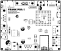
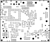

# FRANK PGA assembly and usage guide

  

FRANK PGA is a full-size board built around the [Pimoroni PGA2350](https://shop.pimoroni.com/products/pga2350) module: an RP2350A with on-module flash and 8 MB PSRAM on a 47-pin grid. The recommended way to mount it is in a PGA socket so the module can be removed and replaced. Native USB runs through a multiplexer into the on-board USB hub, and there is ESD protection plus dedicated reset and boot buttons.

If you'd rather use a Pico-pinout module, [FRANK](./frank.md) has the same outline and feature set but uses a Raspberry Pi Pico / Pico 2 in a Pico-pinout socket.

- **PCB size:** 99.5 × 83.1 mm
- **KiCad project:** [`hardware/frank_pga/`](../hardware/frank_pga)
- **Gerbers:** [`hardware/frank_pga/gerbers/`](../hardware/frank_pga/gerbers/)
- **BOM, schematics PDF, assembly drawing:** [`hardware/frank_pga/docs/`](../hardware/frank_pga/docs/)

## How it differs from FRANK

| Topic | FRANK | FRANK PGA |
|-------|-------|-----------|
| Compute | Pico / Pico 2 in a Pico-pinout socket | Pimoroni PGA2350 in a PGA socket |
| USB-emulated PS/2 (RP2040-Zero) | Yes | No. The PGA2350 handles USB directly, so USB keyboards work without a helper. The hardware PS/2 port is on both boards. |
| USB host path | Stacked, with hub | Stacked, with hub plus an analog USB multiplexer (74HC4052D on the D+/D− lines) so the host port can swap between the PGA2350 and a flashing port |
| ESP-01 reset and bootsel | Manual | Dedicated push-buttons (RP BOOT, RP Reset, ESP Reset) |
| ESD protection | — | USBLC6-2SC6 on the USB lines |
| Audio multiplexer | 1 × 74HC4052D | 1 × 74HC4052D |
| USB-host multiplexer | — | 1 × 74HC4052D on D+/D− to swap between the PGA2350 and a flashing path |

Everything else (HDMI, VGA, composite, gamepad ports, audio path, ESP-01S socket, MicroSD, PS/2, tape input) matches FRANK.

## What's on the board

| Subsystem | Component(s) | Purpose |
|-----------|--------------|---------|
| Compute | Pimoroni PGA2350 (in a PGA socket) | RP2350A module with flash and PSRAM |
| Power | MP1584EN-LF-Z buck | 5–28V DC → 5V |
| Power | AMS1117-3.3 | 5V → 3.3V LDO |
| Video | HDMI Type A, VGA DE-15, RCA composite, TFT header | Three video outs plus a parallel TFT header |
| Audio out | PJ-320D 3.5mm | Line-level |
| Audio | PAM8403D + LM358 + 2 × 74HC4052D | Speaker amp, op-amp buffer, audio multiplexer |
| Audio DAC | TDA1387T | I2S DAC |
| Tape in | PJ-320D + CD4069UBM | Cassette load; CD4069UBM conditions the tape signal |
| Storage | MicroSD slot 104031-0811 | ROMs, WADs, disk images etc. |
| Keyboard / mouse | PS/2 (DC3RX19JA2 mini-DIN) | Hardware PS/2 |
| USB host | USB4215 stacked + MW7211A hub + 74HC4052D analog mux | Stacked USB Type-A host. The hub fans out the RP2350's USB host port; the analog mux lets the same port swap between the PGA2350 and a flashing path. |
| Gamepad | 2 × DB9 (104031-0811) | Famicom-style controllers |
| Network | ESP-01S socket | Optional WiFi via [frank-netcard](https://github.com/rh1tech/frank-netcard) |
| Level shifting | TXS0104EDR | 3.3V ↔ 5V |
| ESD | USBLC6-2SC6 | Protects the USB-D+/D- lines |
| Buttons | RP BOOT, RP Reset, ESP Reset | Tactile push-buttons |
| Configuration | Switches | TDA ↔ PWM audio source, tape-in enable, mouse-port pull-ups, mono mix, PAM8403D shutdown |

## Bill of materials (high-level)

The full pick-and-place BOM is in `bom.html`. Headline counts:

### Active parts

| Ref | Part | Qty | Notes |
|-----------------|------|-----|-------|
| U | Pimoroni PGA2350 | 1 | Mounts in a PGA socket on the 47-pin grid (recommended). Has flash + PSRAM on-module. |
| U | TDA1387T | 1 | SO-8 audio DAC |
| U | PAM8403D | 1 | SOP-16 speaker amp |
| U | LM358 | 1 | SOIC-8 op-amp |
| U | CD4069UBM | 1 | SOIC-14 hex inverter |
| U | 74HC4052D | 2 | SOIC-16 analog multiplexer (1 × audio routing, 1 × USB host mux on D+/D−) |
| U | TXS0104EDR | 1 | SOIC-14 level shifter |
| U | MP1584EN-LF-Z | 1 | SOIC-8 buck |
| U | AMS1117-3.3 | 1 | SOT-223 LDO |
| U | MW7211A | 1 | SOIC-16 USB hub |
| U | USBLC6-2SC6 | 1 | SOT-23-6 USB ESD protection |
| U | ESP-01v090 | 1 | Socketed |

### Passives

| Reference style | Value | Qty (rounded) | Footprint |
|-----------------|-------|---------------|-----------|
| C | 100 nF | 16 | 0805 |
| C | 10 µF | 13 | 0805 |
| C | 1 µF / 4.7 µF / 47 nF / 150 pF | mixed | 0805 |
| C | 100 µF / 220 µF / 680 µF | bulk | through-hole electrolytic |
| R | 10 kΩ | 17 | 0805 |
| R | 270 Ω | 14 | 0805 (resistor DACs) |
| R | 22 Ω / 1 kΩ / 100 kΩ / 100 Ω / 150 Ω | mixed | 0805 |
| L | 22 µH | 1 | Buck inductor |
| D | 1N5819WS, 1N5822 | 2 | Schottky |

### Connectors and mechanical

| Part | Qty | Purpose |
|------|-----|---------|
| DC-005-5A-2.0 | 1 | DC barrel jack |
| Switch SK12D07VG3NS | 1 | Power |
| RCA-103 | 1 | Composite |
| VGA HD15 | 1 | VGA |
| HDMI Type A | 1 | HDMI |
| PJ-320D | 2 | Audio out + tape in (3.5mm jacks) |
| USB4215-03-A | 1 | Stacked USB Type-A |
| 104031-0811 | 1 | MicroSD slot |
| DC3RX19JA2 | 1 | PS/2 mini-DIN |
| DB9 (right-angle) | 2 | Gamepad ports |
| RP BOOT, RP Reset, ESP Reset | 3 | Tactile buttons |
| MSK12C02 + SK12D07VG3NS | 2 | Configuration switches |
| Mounting holes 2.7 mm | 4 | M2.5 / M3 |

## Suggested soldering order

Component placement and silkscreen labels for both sides:

| Top | Bottom |
|:---:|:------:|
|  |  |

The PGA2350 module (or its PGA socket) sits flush against the board, so the densest small parts have to go on first. Once the socket is in place — and certainly once the PGA module is seated — the area underneath is inaccessible.

1. **All 0805 resistors and capacitors** in the area covered by the PGA socket / module first. Match values to silkscreen. Drag-soldering or hot-air both work.
2. **Surface-mount ICs:**
   - USBLC6-2SC6 (SOT-23-6)
   - TXS0104EDR
   - 74HC4052D × 2 (one for the audio multiplexer, one for the USB-host multiplexer on D+/D−)
   - CD4069UBM
   - LM358
   - PAM8403D
   - MW7211A USB hub
   - MP1584EN, AMS1117 LDO
3. **Tactile buttons** (RP BOOT, RP Reset, ESP Reset). Solder them now while the area is empty.
4. **PGA socket** (recommended) — solder it onto the 47-pin grid before populating the rest of the board. Tack two opposite corners, check alignment under magnification, then solder the remaining pins. The PGA2350 module itself goes in last, after first-boot checks.

   If you choose to skip the socket and solder the PGA2350 directly, use plenty of flux, tack two opposite corners, check alignment, then drag-solder the perimeter. Inspect every pad: bridges are easy. A continuity tester between adjacent pads helps.
5. **TDA1387T** (SO-8).
6. **Diodes** (watch polarity).
7. **Power inductor (22 µH)** and ferrites.
8. **Bulk electrolytic capacitors** (polarity matters).
9. **Through-hole connectors** in the same order as for FRANK:
   - DC jack
   - Power switch
   - 3.5mm jacks
   - RCA composite
   - HDMI
   - VGA
   - MicroSD slot
   - PS/2 mini-DIN
   - USB Type-A stacked
   - DB9 × 2
10. **ESP-01S socket** (2 × 4 female header).
11. **TFT display header** (optional).
12. **Mounting hardware.**

Bench-test after each major group:

- After step 1–4: probe the 5V and 3.3V rails for shorts before applying power.
- After step 9: with the PGA2350 seated in the socket, bring up power and check it enumerates over USB (hold BOOT, press Reset, release BOOT; the UF2 drive should appear). Confirm video on HDMI before adding gamepad and audio jacks.

## First boot

1. Connect a display to one of the video outputs: HDMI, VGA, or RCA composite. The firmware selects which output is active.
2. Connect a PS/2 or USB keyboard.
3. Insert a FAT32 SD card with ROMs / disk images. The card stores content the firmware reads at runtime — it does not flash the RP2350A.
4. To install or update firmware, hold **RP BOOT** while pressing **RP Reset**, then drag-and-drop a `.uf2` file onto the `RPI-RP2` mass-storage drive that the RP2350A presents over USB.
5. Power on.

The on-board buttons remove the need to reach for the BOOTSEL button on a Pico module:

- **RP BOOT + RP Reset** — enter the RP2350A bootloader for `.uf2` flashing.
- **ESP Reset** — resets the ESP-01S WiFi module without power-cycling the board.

## Connecting PSRAM

The PGA2350 module already includes 8 MB of PSRAM, so no extra modification is needed. Flash an emulator that knows about the PGA2350 PSRAM mapping (most M2P2 firmware does).

## Troubleshooting

| Symptom | Likely cause |
|---------|--------------|
| PGA2350 not enumerating | Module not fully seated in the PGA socket, or — if soldered direct — bridged pins under the module. Reseat the module, or inspect the perimeter under magnification and reflow with hot air. |
| Random crashes on USB load | USBLC6 ESD diode reversed, or the multiplexer not switched correctly. |
| Audio cuts out / channel swapped | Verify both 74HC4052D ICs are present and the correct way around. |
| WiFi (ESP-01S) does nothing | ESP-01S not flashed. See [frank-netcard](https://github.com/rh1tech/frank-netcard). |
| Powered but board cold | MP1584 not switching. Check the 22 µH inductor and the feedback divider resistors. |

