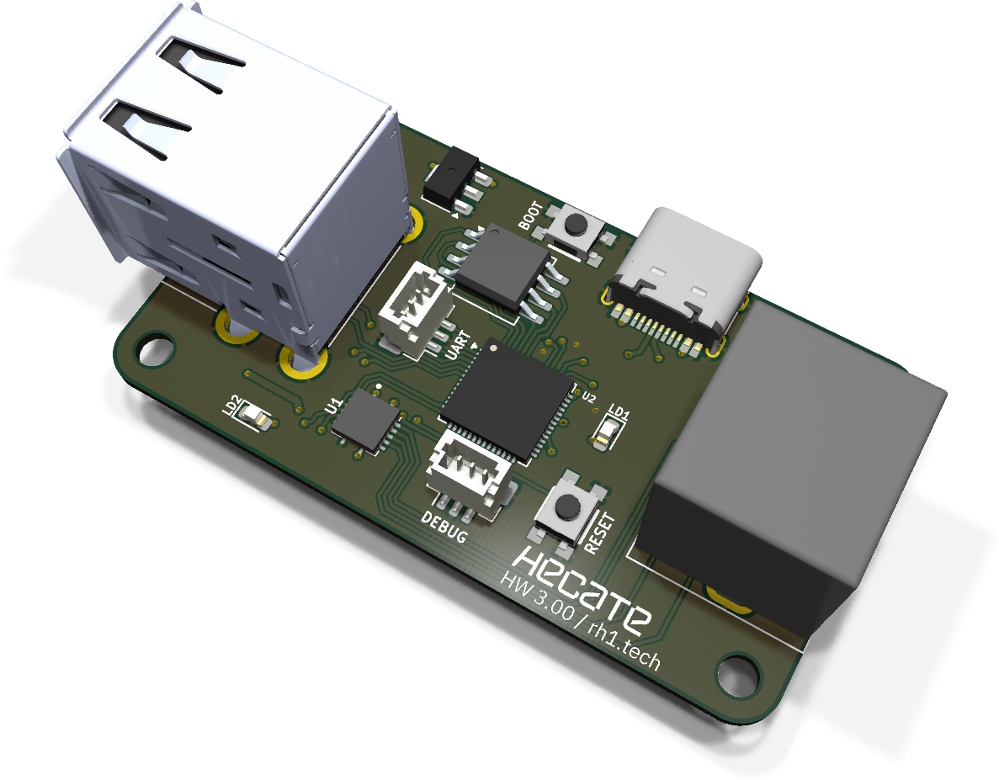
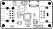
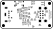

# Hecate assembly and usage guide

  

Hecate is a standalone USB-to-PS/2 bridge board built around the RP2040. It takes modern
USB keyboards and mice and presents them to a vintage host as PS/2 devices, so you can use
current peripherals with anything that only speaks PS/2. The board is the hardware
companion to the [Hecate firmware](https://github.com/rh1tech/hecate); the same firmware
that runs on FRANK's on-board RP2040-Zero runs here on a dedicated PCB.

It exposes a native USB Type-C host, a stacked USB Type-A host and PIO-USB ports, so you
can connect several devices (directly or through a hub) and have them all appear on a
single PS/2 mini-DIN output.

- **PCB size:** 53 × 29 mm
- **Compute:** RP2040, on-board
- **Firmware:** [github.com/rh1tech/hecate](https://github.com/rh1tech/hecate)
- **KiCad project:** [`hardware/hecate/`](../hardware/hecate)
- **Gerbers:** [`hardware/hecate/gerbers/`](../hardware/hecate/gerbers/)
- **BOM, schematics PDF, assembly drawing:** [`hardware/hecate/docs/`](../hardware/hecate/docs/)

## What's on the board

| Subsystem | Component(s) | Purpose |
|-----------|--------------|---------|
| Compute | RP2040 QFN | USB host + PS/2 emulation |
| USB host (native) | USB Type-C | Native RP2040 USB host |
| USB host (PIO) | USB Type-A stacked + PIO-USB | Extra USB host ports for keyboard / mouse / hub |
| PS/2 output | mini-DIN-6 | Combined keyboard + mouse PS/2 output |
| Debug | 3-pin JST-SH SWD | Serial-wire debug |
| Buttons | BOOT, RESET | Bootsel + reset |
| Indicators | 2 × LED | Connection / activity |

## Bill of materials (high-level)

The full, exact BOM is generated from the KiCad project and published as
[`hardware/hecate/docs/<rev>/bom.html`](../hardware/hecate/docs/). The headline parts are
the RP2040, its QSPI flash, the USB-C and stacked USB-A connectors, the PS/2 mini-DIN and
the LDO.

## Assembly notes

- The RP2040 is a QFN — hot air or hot plate. Solder it and the flash first, then the LDO
  and passives, then the connectors.
- PS/2 uses open-drain signalling; the host provides the pull-ups, so no special board
  pull-ups are required on the PS/2 lines.

## Firmware and usage

1. Flash the [Hecate firmware](https://github.com/rh1tech/hecate): hold BOOT, connect
   USB-C, release, and copy `hecate.uf2` to the drive that appears.
2. Connect your USB keyboard and/or mouse to a USB host port (Type-C, the stacked Type-A,
   or through a hub).
3. Wire the PS/2 mini-DIN to the vintage host. Once a device is connected, the status LED
   lights; it blinks on activity.

See the [firmware README](https://github.com/rh1tech/hecate) for the full feature list
(Scancode Set 2, IntelliMouse, NKRO, typematic, LED sync, and so on) and pinout.

## Silkscreen

| Top | Bottom |
|:---:|:---:|
|  |  |

## Troubleshooting

- **Host doesn't see the keyboard/mouse:** confirm the PS/2 mini-DIN wiring (DATA, CLK,
  +5 V, GND) and that the host powers the PS/2 port.
- **USB device not recognised:** try a different host port; some devices need the native
  Type-C port rather than a PIO-USB port.
- **No LED:** the status LED only lights once a USB device enumerates — connect a keyboard
  or mouse first.
