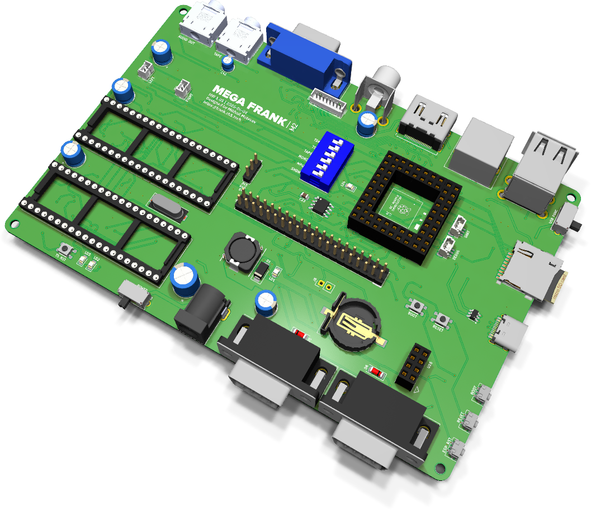
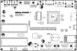
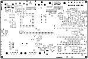

# MegaFRANK assembly and usage guide

  

MegaFRANK is the maximal FRANK: every output, every audio path and an on-board TurboSound sound module on a single full-size PCB. Compute is the Pimoroni PGA2350 (RP2350B module with on-module flash and 8 MB PSRAM), so all PSRAM-requiring firmware runs without any extra modules. If you want one board that does literally everything FRANK can do, this is it.

It carries the complete output set — HDMI, VGA, composite/TFT paths, hardware PS/2, two DB9 gamepad ports — plus on-board dual YM2149 TurboSound, a DS3231 real-time clock, a DS2401 silicon serial number, ESP-01S WiFi, a MicroSD slot and dual power inputs. The M2 GPIO layout means any M2 firmware build runs on it.

- **PCB size:** 149.9 × 99.5 mm (full size)
- **Compute:** Pimoroni PGA2350 (RP2350B module, on-module flash + 8 MB PSRAM)
- **KiCad project:** [`hardware/megafrank/`](../hardware/megafrank)
- **Gerbers:** [`hardware/megafrank/gerbers/`](../hardware/megafrank/gerbers/)
- **BOM, schematics PDF, assembly drawing:** [`hardware/megafrank/docs/`](../hardware/megafrank/docs/)

> **Recently promoted from [frank-lab](https://github.com/rh1tech/frank-lab).** MegaFRANK
> is the largest and most complex FRANK board. Review the schematic and BOM before
> ordering a PCB.

## What's on the board

| Subsystem | Component(s) | Purpose |
|-----------|--------------|---------|
| Compute | Pimoroni PGA2350 (RP2350B) | Module socket. On-module flash + 8 MB PSRAM. |
| Sound module | 2 × YM2149 / AY-3-8910 (DIP-40 sockets) | On-board TurboSound. Socketed so you can fit genuine or NOS chips. |
| Sound clock | HC49-S crystal + 74HCT74 | Clock source and divider for the sound chips |
| Audio DAC | TDA1387T | I²S line-level audio |
| Speaker amp | PAM8403 | On-board speaker amplifier |
| Real-time clock | DS3231 | Battery-backed RTC (coin cell) |
| Silicon serial | DS2401 | 1-Wire unique ID |
| Video | HDMI Type A, VGA DE-15 | HDMI + VGA out |
| Keyboard / mouse | PS/2 (mini-DIN-6) | Hardware PS/2 |
| Gamepad | 2 × DB9 | Two Famicom-style controller ports |
| USB host | USB Type-A stacked + hub + multiplexer | Stacked USB host for keyboards, mice and gamepads |
| USB power / data | USB Type-C | 5 V input / data |
| Network | ESP-01S socket | Optional WiFi via [frank-netcard](https://github.com/rh1tech/frank-netcard) |
| Storage | MicroSD slot | ROMs, WADs, disk images |
| Audio out / tape | 2 × 3.5 mm jacks | Line-level audio out + cassette tape in |
| Power | 2 × DC barrel jack | Dual power input |
| Buttons | RP Reset, BOOT, ESP Reset | Reset / bootsel buttons |
| Layout | M2 GPIO | Any M2 firmware build runs on it |

## Bill of materials (high-level)

The full, exact BOM (with reference designators, values and footprints) is generated from
the KiCad project and published as [`hardware/megafrank/docs/<rev>/bom.html`](../hardware/megafrank/docs/).
The headline active parts are:

| Part | Qty | Notes |
|------|-----|-------|
| Pimoroni PGA2350 | 1 | RP2350B module (compute) |
| YM2149 / AY-3-8910 | 2 | DIP-40, socketed (TurboSound) |
| 74HCT74 | 1 | Dual flip-flop, sound clock divider |
| TDA1387T | 1 | I²S audio DAC |
| PAM8403 | 1 | Class-D speaker amp |
| DS3231 | 1 | Real-time clock |
| DS2401 | 1 | 1-Wire silicon serial number |
| ESP-01S | 1 | Socketed WiFi module |
| HC49-S crystal | 1 | Sound chip clock |

## Assembly notes

- Solder the SMD parts first (DAC, amp, RTC, hub/multiplexer, passives), working from the
  smallest packages outward, then fit the through-hole connectors and the DIP-40 sound
  sockets last.
- The sound chips sit in DIP-40 sockets — do **not** solder the YM2149/AY-3-8910 directly;
  socket them so you can swap chips.
- The PGA2350 mounts in its module socket; seat it after the board is otherwise complete.
- Fit the DS3231 coin cell only after confirming the rest of the board powers up.

## First boot

1. Fit the PGA2350 module and (optionally) the sound chips and ESP-01S.
2. Power the board from one of the DC barrel jacks.
3. Hold BOOT on the RP module, connect USB-C, release, and copy a `.uf2` to the drive that
   appears (or use `picotool load`). [frank-kickstart](https://github.com/rh1tech/frank-kickstart)
   is a good first flash — it gives you an SD-card firmware launcher.
4. Connect a display (HDMI or VGA), a keyboard (PS/2 or USB) and a gamepad, and insert an
   SD card with ROMs.

## Silkscreen

| Top | Bottom |
|:---:|:---:|
|  |  |

## Troubleshooting

- **No video:** confirm the PGA2350 is fully seated and the firmware matches your output
  (HDMI vs VGA). Most firmware auto-detects; some has a build-time switch.
- **No sound from TurboSound:** check the YM2149/AY-3-8910 are seated the right way round
  and that the sound clock crystal is populated.
- **RTC not keeping time:** fit a fresh coin cell and verify the DS3231 orientation.
- **WiFi firmware can't see the ESP:** the ESP-01S is optional — fit it only for
  WiFi-enabled firmware such as [frank-manul](https://github.com/rh1tech/frank-manul) or
  [frank-netcard](https://github.com/rh1tech/frank-netcard).
