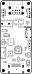
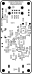

# MicroFRANK assembly and usage guide

  

MicroFRANK is the smallest board in the family. It is a smaller version of FRANK with the RP2350A, flash, PSRAM and the stacked USB host on the PCB itself. There is no VGA, no hardware PS/2, no DB9 gamepad and no ESP-01S socket; keyboards, mice and gamepads connect over USB. Power comes in over USB-C.

If you want VGA, composite, the DB9 ports, or WiFi, build FRANK or MiniFRANK. Pick MicroFRANK when the size matters and HDMI plus USB is enough.

- **PCB size:** 32 × 74 mm
- **KiCad project:** [`hardware/microfrank/`](../hardware/microfrank)
- **Gerbers:** [`hardware/microfrank/gerbers/`](../hardware/microfrank/gerbers/)
- **BOM, schematics PDF, assembly drawing:** [`hardware/microfrank/docs/`](../hardware/microfrank/docs/)

## What's on the board

| Subsystem | Component(s) | Purpose |
|-----------|--------------|---------|
| Compute | RP2350A QFN-60 | Soldered directly to the PCB. |
| Flash | W25Q128JVS | 16 MB SPI flash |
| PSRAM | ESP-PSRAM64H | 8 MB PSRAM (SOIC-8) |
| Crystal | ASE-12 MHz | RP2350A clock |
| Power | ME6211C33M5 | LDO from USB to 3.3V |
| Video | HDMI Type A | Single video output (HDMI only) |
| Audio | TDA1387T I2S DAC + LM358 op-amp + PJ-320D 3.5mm | Line-level audio |
| Storage | MicroSD slot (Molex 0475710001) | ROMs, WADs, disk images |
| USB host | USB4215 stacked + MW7211A hub + TS3USB221 multiplexer + USBLC6-2SC6 ESD | Stacked USB Type-A host. The hub fans out the RP2350's single USB host port; the multiplexer lets the same port swap between RP2350-driven host mode and a flashing path. |
| USB power input | USB Type-C | The board takes 5V over USB-C. |
| Buttons | 1 × tactile (RP Boot) | For entering BOOTSEL |
| Switches | SK12D07VG3NS, MSK12C02 | Power and configuration (TDA ↔ PWM audio source, mono mix) |

## Bill of materials (high-level)

The full pick-and-place BOM is in `bom.html`.

### Active parts

| Ref | Part | Qty | Notes |
|-----------------|------|-----|-------|
| U | RP2350A | 1 | QFN-60 |
| U | W25Q128JVS | 1 | SOIC-8 flash |
| U | ESP-PSRAM64H | 1 | SOIC-8 PSRAM |
| Y | ASE-12 MHz | 1 | Crystal oscillator |
| U | TDA1387T | 1 | SO-8 audio DAC |
| U | LM358 | 1 | SOIC-8 op-amp |
| U | TS3USB221RSER | 1 | USB switch |
| U | USBLC6-2SC6 | 1 | USB ESD diode |
| U | MW7211A | 1 | USB hub |
| U | ME6211C33M5 | 1 | SOT-23-5 LDO |

### Passives

| Reference style | Value | Qty | Footprint |
|-----------------|-------|-----|-----------|
| C | 100 nF | 20 | 0603 |
| C | 10 µF | 12 | 0603 |
| C | 4.7 µF | 5 | 0603 |
| R | 10 kΩ | 9 | 0603 |
| R | 22 Ω | 6 | 0603 |
| R | 1 kΩ / 5.1 kΩ / 470 Ω / 47 kΩ / 27 Ω | mixed | 0603 |
| L | 3.3 µH | 1 | Power inductor |
| L | 330 Ω ferrite | 1 | 0603 |
| D | 1N5819WS | 1 | Schottky |

### Connectors and mechanical

| Part | Qty | Purpose |
|------|-----|---------|
| HDMI Type A | 1 | HDMI |
| Molex 0475710001 | 1 | MicroSD slot |
| USB4215-03-A | 1 | Stacked USB Type-A host |
| USB Type-C | 1 | Power input |
| PJ-320D | 1 | 3.5mm audio out |
| Switch SK12D07VG3NS | 1 | Power |
| Switch MSK12C02 | 1 | Configuration |
| Tactile button | 1 | RP Boot |
| Mounting holes 2.7 mm | 4 | M2.5 |

## Suggested soldering order

Component placement and silkscreen labels for both sides:

| Top | Bottom |
|:---:|:------:|
|  |  |

This is the densest of the four boards. A microscope or a good magnifier plus hot air make this much easier.

1. **RP2350A QFN-60.** Apply solder paste, place with tweezers, reflow with hot air at ~280 °C. Inspect every pin under magnification.
2. **W25Q128JVS flash, ESP-PSRAM64H, 12 MHz crystal.** Pin 1 orientation matters.
3. **0603 decoupling capacitors** around the RP2350A and the flash / PSRAM.
4. **Other 0603 resistors and capacitors.**
5. **Surface-mount ICs:**
   - TS3USB221RSER
   - USBLC6-2SC6
   - MW7211A USB hub
   - LM358
   - ME6211C33M5 LDO
6. **Power inductor (3.3 µH) and the Schottky diode.**
7. **Tactile button (RP Boot).**
8. **Switches (SK12D07VG3NS, MSK12C02).**
9. **Through-hole and SMT connectors:**
   - HDMI Type A
   - PJ-320D 3.5mm jack
   - MicroSD slot (Molex 0475710001)
   - USB Type-A stacked
   - USB Type-C (power input)
10. **TDA1387T** (SO-8 DAC).
11. **Mounting hardware** if you are putting it in a project box.

Bench-test points:

- After step 1–2: probe USB power to GND for shorts.
- After step 5: plug USB in. Hold the RP Boot button while plugging — the RP2350A should appear as `RPI-RP2` mass storage.
- After step 9: check HDMI output with a known-good firmware UF2.

## First boot

1. Plug USB-C into the power port to feed 5V.
2. Connect a display to the HDMI output (the only video output on this board).
3. Plug a USB keyboard into the stacked USB Type-A host port. There is no PS/2 on this board, so the keyboard has to be USB.
4. Insert a FAT32 SD card with ROMs / disk images. The card stores content the firmware reads at runtime — it does not flash the RP2350A.
5. Power on with the power switch.

To install or update firmware, hold the **RP Boot** button while powering on (or while pressing reset, depending on the firmware variant). The RP2350A enumerates over USB-C as the `RPI-RP2` mass-storage drive — drag-and-drop a `.uf2` file onto it to flash.

## What MicroFRANK cannot do

Things to know before ordering this board:

- No VGA output. HDMI only.
- No composite video.
- No PS/2 port. The other three boards have one; here every keyboard or mouse has to be USB.
- No DB9 gamepad ports. Gamepads have to be USB too.
- No ESP-01S WiFi socket.
- No on-board speaker amp. Line-level audio out only.
- No tape input.

If your firmware needs any of these, build MiniFRANK or FRANK instead.

## Troubleshooting

| Symptom | Likely cause |
|---------|--------------|
| Board not detected as USB drive | QFN reflow incomplete, especially the thermal pad. Apply more flux and reflow with hot air. |
| Crashes after a few seconds of running | PSRAM not soldered correctly. |
| No HDMI signal | Wrong firmware variant for this layout, or HDMI signal traces shorted. |
| Distorted audio | LM358 op-amp not getting clean 3.3V; check decoupling caps. |
| USB devices not enumerating | MW7211A hub or TS3USB221 switch not making contact; reflow. |

