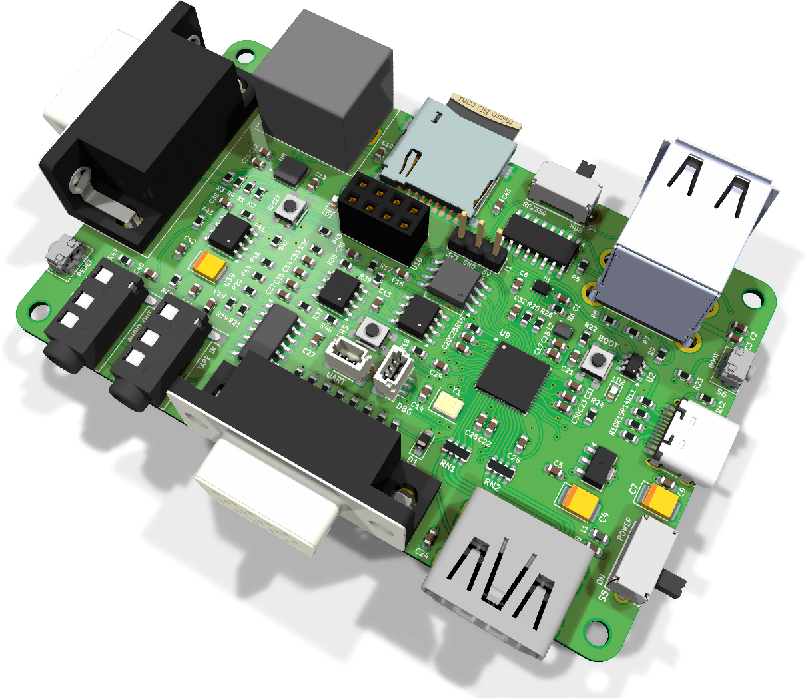
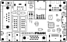
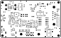

# MiniFRANK assembly and usage guide

  

MiniFRANK is the credit-card-sized board. The RP2350A and the W25Q128 flash chip are soldered directly to the PCB, so there is no Pico module socket. PSRAM (ESP-PSRAM64, 8 MB) is also on-board, so most emulators that need PSRAM work without any external modules.

It keeps almost everything from the full-size FRANK (HDMI, VGA, PS/2, ESP-01S WiFi, MicroSD, audio out and tape in) in a much smaller form factor. The trade-offs: only one DB9 gamepad port, no composite output, and no on-board speaker amp. Power comes in over a USB Type-C connector — there is no DC barrel jack on this board.

- **PCB size:** 85.6 × 53.98 mm (credit-card sized)
- **KiCad project:** [`hardware/minifrank/`](../hardware/minifrank)
- **Gerbers:** [`hardware/minifrank/gerbers/`](../hardware/minifrank/gerbers/)
- **BOM, schematics PDF, assembly drawing:** [`hardware/minifrank/docs/`](../hardware/minifrank/docs/)

## What's on the board

| Subsystem | Component(s) | Purpose |
|-----------|--------------|---------|
| Compute | RP2350A QFN-60 | Soldered directly to the PCB. The board is the Pico. |
| Flash | W25Q128JVS | 16 MB SPI flash |
| PSRAM | ESP-PSRAM64 | 8 MB PSRAM |
| Crystal | ASE-12 MHz | RP2350A clock source |
| Power | AMS1117-3.3 | LDO that drops the 5 V USB-C rail to 3.3 V |
| Video | HDMI Type A, VGA DE-15 | Two video outs |
| Audio out | PJ-320D 3.5 mm | Line-level via TDA1387T DAC |
| Audio | LM358 + CD4069UBM | Op-amp buffer and PWM filter (no on-board speaker amp) |
| Tape in | PJ-320D | Cassette load |
| Storage | MicroSD slot | ROMs, WADs, disk images |
| Keyboard / mouse | PS/2 (DC3RX19JA2 mini-DIN) | Hardware PS/2 |
| USB host | USB4215 stacked + MW7211A hub + TS3USB221 multiplexer | Stacked USB Type-A host. The hub fans out the RP2350's single USB host port; the multiplexer lets the same port swap between RP2350-driven host mode and a flashing path. |
| USB power input | USB Type-C | The board takes 5 V over USB-C. There is no DC barrel jack on this board. |
| Gamepad | 1 × DB9 (104031-0811) | Famicom-style controller |
| Network | ESP-01S socket | Optional WiFi |
| Level shifting | TXS0104ERGYR | 3.3 V ↔ 5 V (5 V signals: PS/2, gamepad) |
| ESD | USBLC6-2SC6 | USB protection |
| Buttons | 4 × RP Reset, 1 × ESP Reset | Multi-purpose reset buttons |
| Slide switches | 2 × SK12D07VG3NS | Power / config |

## Bill of materials (high-level)

The full pick-and-place BOM is in `bom.html`. Headline counts:

### Active parts

| Reference style | Part | Qty | Notes |
|-----------------|------|-----|-------|
| U | RP2350A | 1 | QFN-60. Hot-air or hot-plate. |
| U | W25Q128JVS | 1 | SOIC-8 flash |
| U | ESP-PSRAM64 | 1 | SOIC-8 PSRAM |
| Y | ASE-12 MHz | 1 | Crystal oscillator (clock for the RP2350A) |
| U | TDA1387T | 1 | DIP-8 audio DAC |
| U | LM358 | 1 | SOIC-8 op-amp |
| U | CD4069UBM | 1 | SOIC-14 hex inverter |
| U | TXS0104ERGYR | 1 | QFN level shifter |
| U | TS3USB221RSER | 1 | USB switch |
| U | USBLC6-2SC6 | 1 | USB ESD diode |
| U | MW7211A | 1 | USB hub |
| U | AMS1117-3.3 | 1 | SOT-223 LDO |
| U | ESP-01v090 | 1 | Socketed |

### Passives

| Reference style | Value | Qty | Footprint |
|-----------------|-------|-----|-----------|
| C | 100 nF | 26 | 0603 |
| C | 10 µF | 10 | 0603 |
| C | 22 µF / 4.7 µF | 7 | 0603 |
| R | 10 kΩ | 13 | 0603 |
| R | 1 kΩ | 7 | 0603 |
| R | 22 Ω / 100 Ω / 270 Ω / 330 Ω / 470 Ω / 5.1 kΩ / 100 kΩ | mixed | 0603 |
| L | 3.3 µH | 1 | Power inductor |
| L | 330 Ω ferrite | 1 | 0603 |
| D | 1N5819WS | 1 | Schottky |
| D | LED 3V3 | 1 | Power indicator |

### Connectors and mechanical

| Part | Qty | Purpose |
|------|-----|---------|
| DC3RX19JA2 | 1 | PS/2 mini-DIN |
| HDMI Type A | 1 | HDMI |
| VGA HD15 | 1 | VGA |
| PJ-320D | 2 | Audio out + tape in |
| USB4215-03-A | 1 | Stacked USB Type-A host |
| USB Type-C | 1 | Power input |
| MicroSD slot | 1 | |
| DB9 right-angle | 1 | Gamepad |
| Slide switch SK12D07VG3NS | 2 | Power + config |
| Reset buttons | 5 | RP Reset × 4, ESP Reset × 1 |
| Mounting holes 2.7 mm | 4 | M2.5 |

## Suggested soldering order

Component placement and silkscreen labels for both sides:

| Top | Bottom |
|:---:|:------:|
|  |  |

MiniFRANK uses 0603 passives, which are smaller than the 0805 parts on FRANK. A microscope or a good magnifier helps. Hot air is recommended for the RP2350A QFN.

1. **RP2350A QFN-60.** Apply solder paste to the pads, place the chip with tweezers, reflow with hot air at ~280 °C until the solder ball signature appears. Inspect under magnification. The thermal pad on the bottom needs a good solder connection, so pre-tin it lightly before placing.
2. **W25Q128JVS flash and ESP-PSRAM64.** SOIC-8 each, immediately around the RP2350A. Pin 1 markings matter.
3. **12 MHz crystal (Y1)** — orientation usually does not matter for two-pin crystals, but check the datasheet for any directional marking.
4. **0603 capacitors and resistors** in the area around the RP2350A. Decoupling caps (100 nF, 10 µF) first.
5. **Other surface-mount ICs:**
   - TXS0104ERGYR (QFN)
   - TS3USB221RSER
   - USBLC6-2SC6
   - MW7211A USB hub
   - LM358
   - CD4069UBM
   - AMS1117-3.3
6. **Power inductor (3.3 µH) and the 1N5819WS Schottky diode.**
7. **Tactile reset buttons** (4 × RP Reset, 1 × ESP Reset).
8. **Slide switches** (2 × SK12D07VG3NS).
9. **Through-hole and SMT connectors** in this order:
   - PS/2 mini-DIN (DC3RX19JA2)
   - 3.5 mm jacks (audio + tape)
   - VGA DE-15
   - HDMI Type A
   - MicroSD slot
   - USB Type-A stacked
   - USB Type-C (power input)
   - DB9 (gamepad)
10. **DIP-8 TDA1387T** (or socket).
11. **ESP-01S 2 × 4 female header** for the WiFi module.
12. **Mounting hardware** (M2.5 stand-offs into the four 2.7 mm holes).

After step 1–2, before adding more components:

- Probe between VBUS / 3.3 V and GND for shorts.
- Plug a USB-C cable into the board's USB-C power port. The RP2350A should appear as `RPI-RP2` mass storage if you hold the BOOT line low while powering on. (BOOT is wired into the RP Reset network on this board; see the schematic for the exact key combination.)

## First boot

1. Plug a USB-C cable into the power port to feed 5 V.
2. Connect HDMI or VGA.
3. Connect a PS/2 keyboard or a USB keyboard (use the stacked USB Type-A host port for USB).
4. Insert an SD card with firmware.
5. Slide the power switch on.

To enter the bootloader for flashing:

- Hold one of the **RP Reset** buttons while applying power, or use the on-board reset combination per the schematic.

## Troubleshooting

| Symptom | Likely cause |
|---------|--------------|
| Board not detected as USB drive | RP2350A QFN solder bridge or cold thermal pad. Reflow with hot air. |
| Boots but crashes immediately | PSRAM not soldered properly or wrong PSRAM firmware variant. |
| No HDMI output | Wrong firmware variant for this board, or the HDMI traces have a short. |
| VGA colours wrong | Resistor DAC values incorrect — verify 270 Ω, 470 Ω, 1 kΩ values. |
| Keyboard doesn't respond | TXS0104 level shifter unsoldered, or PS/2 cable wired to a non-AT keyboard. |
| Audio distorted | Op-amp (LM358) supply rail noisy; check decoupling caps near it. |
| ESP-01S not connecting | ESP-01S not flashed with `frank-netcard`. The ESP Reset button only resets — it does not re-flash. |

