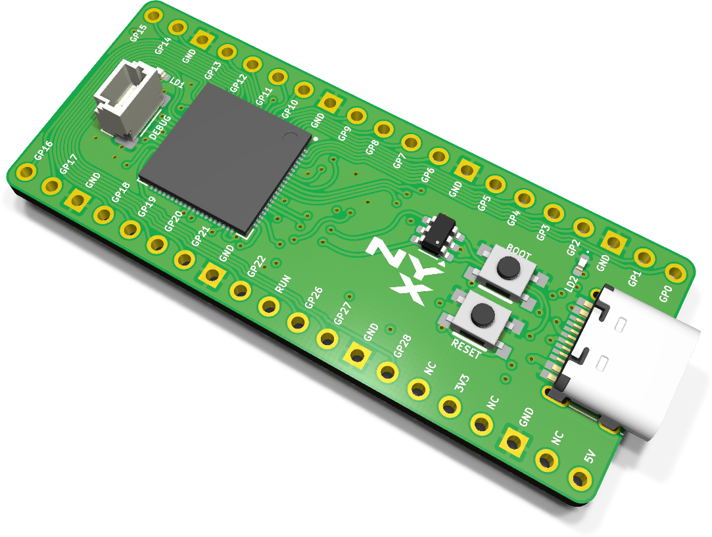
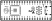
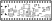

# Nyx assembly and usage guide

  

Nyx is an open-source Raspberry Pi Pico 2 clone based on the RP2350B (80-pin QFN). It is pin-compatible with the Pico 2 form factor and includes 16 MB flash and 8 MB PSRAM on-board, so every FRANK firmware — including those that require PSRAM — works out of the box when you plug Nyx into the FRANK socket.

Think of it as a DIY equivalent of the [Pimoroni Pico Plus 2](https://shop.pimoroni.com/products/pimoroni-pico-plus-2): same RP2350B chip, same PSRAM, same dedicated USB D+/D− lines, same SWD debug connector — but fully open source and without the battery management circuitry.

- **PCB size:** 51 × 21 mm (Pico 2 form factor)
- **KiCad project:** [`hardware/nyx/`](../hardware/nyx)
- **Gerbers:** [`hardware/nyx/gerbers/`](../hardware/nyx/gerbers/)
- **BOM, schematics PDF, assembly drawing:** [`hardware/nyx/docs/`](../hardware/nyx/docs/)

## What's on the board

| Subsystem | Component(s) | Purpose |
|-----------|--------------|---------|
| Compute | RP2350B QFN-80 | The full 80-pin variant with extra GPIO (including GPIO47 for PSRAM) |
| Flash | W25Q128JVS | 16 MB SPI flash |
| PSRAM | ESP-PSRAM64H (on GPIO47) | 8 MB PSRAM |
| Crystal | ASE-12 MHz | RP2350B clock source |
| Power | ME6211C33M5 | LDO that drops 5 V USB to 3.3 V |
| USB | USB Type-C with dedicated D+/D− | Native USB (not routed through GPIO) |
| ESD | USBLC6-2SC6 | USB protection |
| Debug | 3-pin JST-SH (1 mm pitch) | SWD debug port (same as Pimoroni Pico Plus 2) |
| Buttons | Boot + RP Reset | BOOTSEL entry and reset |
| LEDs | 2 × 0402 | Power indicator and user LED |
| Expansion | 2 × 20-pin headers (2.54 mm) | Standard Pico 2 pinout |

## What's different from a Pimoroni Pico Plus 2

| Feature | Pimoroni Pico Plus 2 | Nyx |
|---------|---------------------|-----|
| MCU | RP2350B | RP2350B |
| Flash | 16 MB | 16 MB |
| PSRAM | 8 MB (GPIO47) | 8 MB (GPIO47) |
| USB D+/D− | Dedicated | Dedicated |
| Debug connector | 3-pin JST-SH | 3-pin JST-SH (same) |
| Battery management | Yes (LiPo charger, power path) | No |
| SP/CE button | Yes | No |
| Open-source hardware | No | Yes (GPL v3) |

## Bill of materials (high-level)

The full pick-and-place BOM is in `bom.html`.

### Active parts

| Ref | Part | Qty | Notes |
|-----|------|-----|-------|
| U | RP2350B | 1 | QFN-80 (10 × 10 mm). Hot-air or hot-plate. |
| U | W25Q128JVS | 1 | SOIC-8 flash |
| U | ESP-PSRAM64H | 1 | SOIC-8 PSRAM |
| Y | ASE-12 MHz | 1 | Crystal oscillator |
| U | USBLC6-2SC6 | 1 | USB ESD diode |
| U | ME6211C33M5 | 1 | SOT-23-5 LDO |

### Passives

| Reference style | Value | Qty | Footprint |
|-----------------|-------|-----|-----------|
| C | 100 nF | ~15 | 0402 |
| C | 10 µF | ~4 | 0603 |
| C | 4.7 µF | ~2 | 0402 |
| C | 1 µF | ~2 | 0402 |
| R | 10 kΩ | ~5 | 0402 |
| R | 1 kΩ / 5.1 kΩ / 22 Ω / 27 Ω / 150 Ω / 330 Ω | mixed | 0402 |
| L | 3.3 µH | 1 | Power inductor |
| L | Ferrite bead | 1 | 0603 |
| D | LED 0402 | 2 | Power + user |

### Connectors and mechanical

| Part | Qty | Purpose |
|------|-----|---------|
| USB Type-C | 1 | Power + data (dedicated D+/D−) |
| Pin headers 1 × 20 (2.54 mm) | 2 | Pico-compatible expansion |
| JST-SH 1 × 3 (1 mm pitch) | 1 | SWD debug connector |
| Tactile buttons | 2 | Boot + Reset |

## Suggested soldering order

Component placement and silkscreen labels for both sides:

| Top | Bottom |
|:---:|:------:|
|  |  |

Nyx uses 0402 passives — a microscope or good magnifier and a fine-tip iron (or hot air) are essential.

1. **RP2350B QFN-80.** Apply solder paste to the pads, place the chip with tweezers, reflow with hot air at ~280 °C. The exposed thermal pad on the bottom must make contact — pre-tin it lightly. Inspect every pin under magnification.
2. **W25Q128JVS flash and ESP-PSRAM64H.** SOIC-8 each. Pin 1 orientation matters.
3. **12 MHz crystal (Y1).**
4. **0402 decoupling capacitors** around the RP2350B and the flash / PSRAM.
5. **Remaining 0402 resistors and capacitors.**
6. **ME6211C33M5 LDO** (SOT-23-5).
7. **USBLC6-2SC6** (SOT-23-6).
8. **Power inductor and ferrite bead.**
9. **LEDs** (0402).
10. **Tactile buttons** (Boot + Reset).
11. **USB Type-C connector.**
12. **JST-SH debug connector.**
13. **Pin headers** (2 × 20, 2.54 mm pitch).

After step 1–4, before adding more components:

- Probe between VBUS / 3.3 V and GND for shorts.
- Plug a USB-C cable in. Hold the BOOT button while powering on — the RP2350B should appear as `RPI-RP2` mass storage.

## First boot

1. Plug a USB-C cable into the Nyx board.
2. Hold the BOOT button while plugging in (or hold BOOT and press Reset).
3. The RP2350B should enumerate as `RPI-RP2` mass storage.
4. Drag-and-drop a `.uf2` file to flash firmware.

When used inside a FRANK board:

1. Plug Nyx into the Pico socket on FRANK.
2. Connect display, keyboard, SD card and power as described in the FRANK guide.
3. All firmware that requires PSRAM will work without any additional modules.

## Use with FRANK

Nyx is designed as a drop-in replacement for the Raspberry Pi Pico 2 in the FRANK socket. Because it has 8 MB PSRAM built in, you do not need to source a Pimoroni Pico Plus 2 or solder a PSRAM chip onto a generic Pico clone.

## Troubleshooting

| Symptom | Likely cause |
|---------|--------------|
| Board not detected as USB drive | RP2350B QFN reflow incomplete (thermal pad or pins). Reflow with hot air and more flux. |
| Boots but crashes immediately | PSRAM not soldered properly or pin 1 orientation wrong. |
| USB device not recognized by host | USBLC6-2SC6 or USB Type-C connector not making contact; check for solder bridges. |
| 3.3 V rail missing | ME6211 LDO not soldered properly or shorted. Check orientation and decoupling caps. |
| Debug probe cannot connect | JST-SH connector orientation wrong or SWD lines shorted. |
