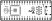
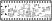

# Nyx: руководство по сборке и эксплуатации

  

Nyx — это клон Raspberry Pi Pico 2 с открытым исходным дизайном на базе RP2350B (QFN на 80 выводов). Плата совместима по выводам с форм-фактором Pico 2 и несет на борту 16 MB флеш-памяти и 8 MB PSRAM, поэтому любая прошивка FRANK — включая те, что требуют PSRAM, — работает сразу после установки Nyx в разъем FRANK.

Считайте Nyx самодельным аналогом [Pimoroni Pico Plus 2](https://shop.pimoroni.com/products/pimoroni-pico-plus-2): та же микросхема RP2350B, та же PSRAM, те же выделенные линии USB D+/D−, тот же разъем отладки SWD — но с полностью открытым дизайном и без схемы управления аккумулятором.

- **Размер платы:** 51 × 21 mm (форм-фактор Pico 2)
- **KiCad-проект:** [`hardware/nyx/`](../hardware/nyx)
- **Gerber-файлы:** [`hardware/nyx/gerbers/`](../hardware/nyx/gerbers/)
- **BOM, схемы PDF, сборочный чертеж:** [`hardware/nyx/docs/`](../hardware/nyx/docs/)

## Состав платы

| Подсистема | Компонент(ы) | Назначение |
|------------|--------------|------------|
| Вычислитель | RP2350B QFN-80 | Полный вариант на 80 выводов с дополнительными GPIO (включая GPIO47 для PSRAM). |
| Флеш-память | W25Q128JVS | SPI-флеш 16 MB. |
| PSRAM | ESP-PSRAM64H (на GPIO47) | 8 MB PSRAM. |
| Кварц | ASE-12 MHz | Тактирование RP2350B. |
| Питание | ME6211C33M5 | LDO, понижающий 5 V с USB до 3.3 V. |
| USB | USB Type-C с выделенными D+/D− | Нативный USB (не через GPIO). |
| Защита от статики | USBLC6-2SC6 | Защита USB. |
| Отладка | 3-контактный JST-SH (шаг 1 мм) | Порт отладки SWD (как у Pimoroni Pico Plus 2). |
| Кнопки | Boot + RP Reset | Вход в BOOTSEL и сброс. |
| Светодиоды | 2 × 0402 | Индикация питания и пользовательский. |
| Расширение | 2 гребенки по 20 контактов (2.54 мм) | Стандартная распиновка Pico 2. |

## Отличия от Pimoroni Pico Plus 2

| Характеристика | Pimoroni Pico Plus 2 | Nyx |
|----------------|----------------------|-----|
| Микроконтроллер | RP2350B | RP2350B |
| Флеш-память | 16 MB | 16 MB |
| PSRAM | 8 MB (GPIO47) | 8 MB (GPIO47) |
| USB D+/D− | Выделенные | Выделенные |
| Разъем отладки | 3-контактный JST-SH | 3-контактный JST-SH (такой же) |
| Управление аккумулятором | Есть (зарядка LiPo, выбор питания) | Нет |
| Кнопка SP/CE | Есть | Нет |
| Открытый дизайн | Нет | Да (GPL v3) |

## Спецификация (BOM, обзор)

Полный BOM для установки компонентов находится в файле `bom.html`.

### Активные компоненты

| Обозначение | Компонент | Кол-во | Примечания |
|-------------|-----------|--------|------------|
| U | RP2350B | 1 | QFN-80 (10 × 10 мм). Фен или нагревательный столик. |
| U | W25Q128JVS | 1 | Флеш-память в SOIC-8. |
| U | ESP-PSRAM64H | 1 | PSRAM в SOIC-8. |
| Y | ASE-12 MHz | 1 | Кварцевый генератор. |
| U | USBLC6-2SC6 | 1 | Диодная сборка защиты USB. |
| U | ME6211C33M5 | 1 | LDO в SOT-23-5. |

### Пассивные компоненты

| Тип обозначения | Номинал | Кол-во | Типоразмер |
|-----------------|---------|--------|------------|
| C | 100 nF | ~15 | 0402 |
| C | 10 µF | ~4 | 0603 |
| C | 4.7 µF | ~2 | 0402 |
| C | 1 µF | ~2 | 0402 |
| R | 10 kΩ | ~5 | 0402 |
| R | 1 kΩ / 5.1 kΩ / 22 Ω / 27 Ω / 150 Ω / 330 Ω | разные | 0402 |
| L | 3.3 µH | 1 | Силовой дроссель |
| L | Ферритовая бусина | 1 | 0603 |
| D | Светодиод 0402 | 2 | Питание + пользовательский |

### Разъемы и механика

| Компонент | Кол-во | Назначение |
|-----------|--------|------------|
| USB Type-C | 1 | Питание и данные (выделенные D+/D−). |
| Гребенки 1 × 20 (2.54 мм) | 2 | Расширение, совместимое с Pico. |
| JST-SH 1 × 3 (шаг 1 мм) | 1 | Разъем отладки SWD. |
| Тактовые кнопки | 2 | Boot + Reset. |

## Рекомендуемый порядок пайки

Расположение компонентов и шелкография с обеих сторон:

| Верх | Низ |
|:---:|:------:|
|  |  |

На Nyx используются пассивные компоненты типоразмера 0402 — микроскоп или хорошая лупа и паяльник с тонким жалом (либо фен) обязательны.

1. **RP2350B QFN-80.** Нанесите паяльную пасту на площадки, установите микросхему пинцетом и оплавьте феном при температуре около 280 °C. Теплоотводящая площадка снизу должна иметь контакт — слегка залудите ее заранее. Проверьте каждый вывод под увеличением.
2. **Флеш-память W25Q128JVS и ESP-PSRAM64H.** Обе в корпусе SOIC-8. Положение первого вывода имеет значение.
3. **Кварц 12 MHz (Y1).**
4. **Развязывающие конденсаторы 0402** вокруг RP2350B, флеш-памяти и PSRAM.
5. **Остальные резисторы и конденсаторы 0402.**
6. **LDO ME6211C33M5** (SOT-23-5).
7. **USBLC6-2SC6** (SOT-23-6).
8. **Силовой дроссель и ферритовая бусина.**
9. **Светодиоды** (0402).
10. **Тактовые кнопки** (Boot + Reset).
11. **Разъем USB Type-C.**
12. **Разъем отладки JST-SH.**
13. **Гребенки** (2 × 20, шаг 2.54 мм).

После шагов 1–4, до установки остальных компонентов:

- Проверьте отсутствие замыканий между VBUS / 3.3 V и землей.
- Подключите кабель USB-C. Удерживая кнопку BOOT при подаче питания, убедитесь, что RP2350B определяется как накопитель `RPI-RP2`.

## Первый запуск

1. Подключите кабель USB-C к плате Nyx.
2. Удерживайте кнопку BOOT при подключении (или удерживайте BOOT и нажмите Reset).
3. RP2350B должен определиться как накопитель `RPI-RP2`.
4. Перетащите файл `.uf2` на этот накопитель, чтобы прошить микроконтроллер.

При использовании в составе платы FRANK:

1. Установите Nyx в разъем для Pico на плате FRANK.
2. Подключите дисплей, клавиатуру, карту SD и питание, как описано в руководстве по FRANK.
3. Все прошивки, требующие PSRAM, будут работать без дополнительных модулей.

## Использование с FRANK

Nyx спроектирован как прямая замена Raspberry Pi Pico 2 в разъеме FRANK. Поскольку на плате уже есть 8 MB PSRAM, вам не нужно искать Pimoroni Pico Plus 2 или впаивать микросхему PSRAM в обычный клон Pico.

## Поиск и устранение неисправностей

| Симптом | Вероятная причина |
|---------|-------------------|
| Плата не определяется как USB-накопитель | Неполное оплавление RP2350B (теплоотводящая площадка или выводы). Прогрейте феном с дополнительным флюсом. |
| Загружается, но сразу зависает | PSRAM плохо пропаяна или неправильно ориентирована по первому выводу. |
| Хост не распознает USB-устройство | Нет контакта на USBLC6-2SC6 или разъеме USB Type-C; проверьте на перемычки из припоя. |
| Отсутствует шина 3.3 V | LDO ME6211 плохо пропаян или закорочен. Проверьте ориентацию и развязывающие конденсаторы. |
| Отладчик не подключается | Неправильная ориентация разъема JST-SH или замыкание линий SWD. |
