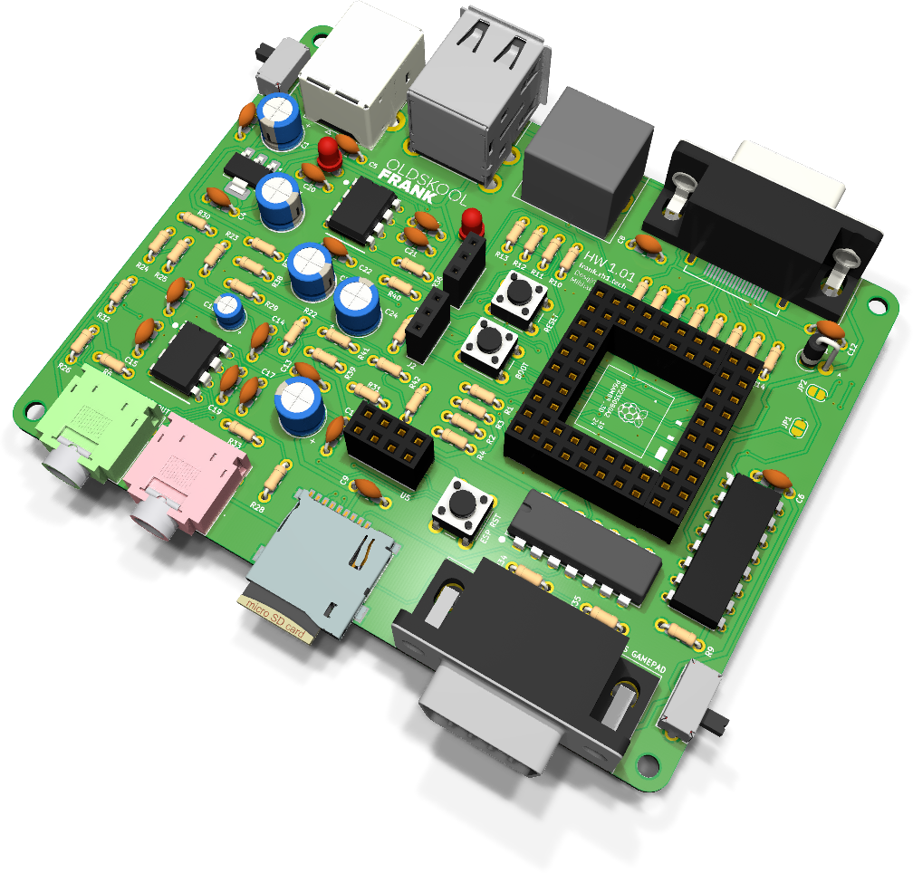
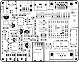
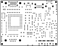

# Old Skool FRANK: руководство по сборке и эксплуатации

  

Old Skool FRANK — плата для тех, кому нужны те самые разъемы, которые были у настоящих машин. Это единственная плата линейки, несущая **одновременно HDMI и настоящий VGA DE-15**, а рядом с ними — аппаратный PS/2 mini-DIN и установленный сверху порт геймпада DB9. Вычислитель — модуль Pimoroni PGA2350 в разъеме, так что RP2350B можно вынуть и заменить.

Это также единственная **двухслойная** плата здесь. Двух слоев достаточно, изготовление обходится дешевле, а ручная сборка и доработка становятся заметно проще, чем на четырехслойных платах: внутренних полигонов, мешающих пайке, просто нет. Звук сделан принципиально аналоговым: ЦАП TDA1545A с буфером на LM358 на зеленое гнездо 3.5 мм и красное гнездо входа магнитофона через CD4069UBE. Тактовые кнопки — выводные, 6 мм, а не SMD.

- **Размер платы:** 100.00 × 79.00 mm
- **Вычислитель:** модуль Pimoroni PGA2350 (RP2350B)
- **KiCad-проект:** [`hardware/oldskool/`](../hardware/oldskool)
- **Gerber-файлы:** [`hardware/oldskool/gerbers/`](../hardware/oldskool/gerbers/)
- **BOM, схемы PDF, сборочный чертеж:** [`hardware/oldskool/docs/`](../hardware/oldskool/docs/)

> **Недавно перенесено из [frank-lab](https://github.com/rh1tech/frank-lab).** Перед заказом
> печатной платы изучите схему и BOM.

## Состав платы

| Подсистема | Компонент(ы) | Назначение |
|------------|--------------|------------|
| Вычислитель | Модуль Pimoroni PGA2350 | RP2350B с флеш-памятью и PSRAM, в разъеме. |
| Видео | HDMI Type A **и** VGA DE-15 | Установлены оба выхода. |
| Клавиатура / мышь | PS/2 mini-DIN-6 | Аппаратный PS/2. |
| Геймпад | DB9 «папа», верхнее крепление | Джойстик в стиле Atari / Sega. |
| USB host | Сдвоенный USB Type-A (2 порта) | Через хаб MW7211A. |
| Коммутация USB | 74HC4052 | Мультиплексирование host. |
| USB (восходящий) | USB Type-C **и** USB Type-B | Два варианта подключения. |
| Аудиовыход | TDA1545A + LM358 + гнездо 3.5 мм (зеленое) | Аналоговый ЦАП с буфером. |
| Вход магнитофона | Гнездо 3.5 мм (красное) + CD4069UBE | Вход с кассеты или линейный. |
| WiFi | Разъем под модуль ESP-01S | Съемный WiFi. |
| Накопитель | Слот MicroSD | ROM-образы, WAD-файлы, образы дисков. |
| Питание | USB-C / USB-B, AMS1117-3.3 | Вход 5 V, единственная шина 3.3 V на LDO. |
| Переключатели | SK12D07VG3NS × 2 | Питание и режим. |
| Кнопки | Выводные тактовые 6 мм × 3 | Загрузка, сброс, пользовательская. |
| Крепеж | 4 × Ø2.7 mm | Без металлизации. |

## Спецификация (BOM, обзор)

Полный точный BOM генерируется из KiCad-проекта и публикуется в файле
[`hardware/oldskool/docs/<rev>/bom.html`](../hardware/oldskool/docs/). Ключевые компоненты —
это модуль Pimoroni PGA2350, хаб MW7211A с мультиплексором 74HC4052, ЦАП TDA1545A с буфером
LM358, каскад входа магнитофона на CD4069UBE и стабилизатор AMS1117-3.3.

## Замечания по сборке

- Это **двухслойная** плата с вычислителем в разъеме, поэтому она самая удобная для ручной
  пайки во всем репозитории. Корпусов QFN, требующих фена, здесь нет.
- Сначала устанавливайте низкопрофильные компоненты, затем высокие разъемы: VGA, DB9, PS/2,
  сдвоенный USB и корпуса аудиогнезд выступают над платой и будут мешать.
- DB9 — это **«папа» с верхним креплением**. Сверьте ориентацию с шелкографией до пайки:
  перевернуть его потом не получится.
- Высота платы в сборе определяется разъемом PGA2350. Устанавливайте модуль только после того,
  как все припаяно и шины питания проверены.

## Первый запуск

1. Установите модуль PGA2350, соблюдая положение первого вывода.
2. Удерживая BOOT, подключите USB-C (или USB-B), отпустите кнопку и скопируйте файл `.uf2` на
   появившийся диск.
3. Подключите дисплей HDMI или монитор VGA.
4. Подключите клавиатуру PS/2, USB-клавиатуру или обе сразу.
5. Установите карту MicroSD с ROM-образами или образами дисков.

## Совместимость прошивок

Old Skool FRANK работает с прошивками, рассчитанными на набор ввода-вывода FRANK с поддержкой
VGA, PS/2 и DB9, — на тот же набор, что используют полноразмерные платы. PSRAM находится в
модуле PGA2350, поэтому прошивки, требующие PSRAM, работают при условии, что установлен модуль
с PSRAM. Часов реального времени на этой плате нет.

## Шелкография

| Верх | Низ |
|:---:|:---:|
|  |  |

## Поиск и устранение неисправностей

- **Нет изображения по VGA:** убедитесь, что сборка прошивки рассчитана на VGA, а не на HDMI:
  установлены оба выхода, но прошивка обычно работает с одним.
- **Геймпад не читается:** DB9 — «папа» с верхним креплением; перевернутая деталь выглядит
  припаянной и при этом не работает.
- **Не работает PS/2:** проверьте заземление экрана mini-DIN и то, что прошивка включает
  аппаратный PS/2.
- **Плата сильно греется:** AMS1117 — линейный стабилизатор. Теплый корпус нормален, горячий
  означает замыкание на шине 3.3 V.
- **Модуль не определяется:** переустановите PGA2350 и проверьте положение первого вывода.
