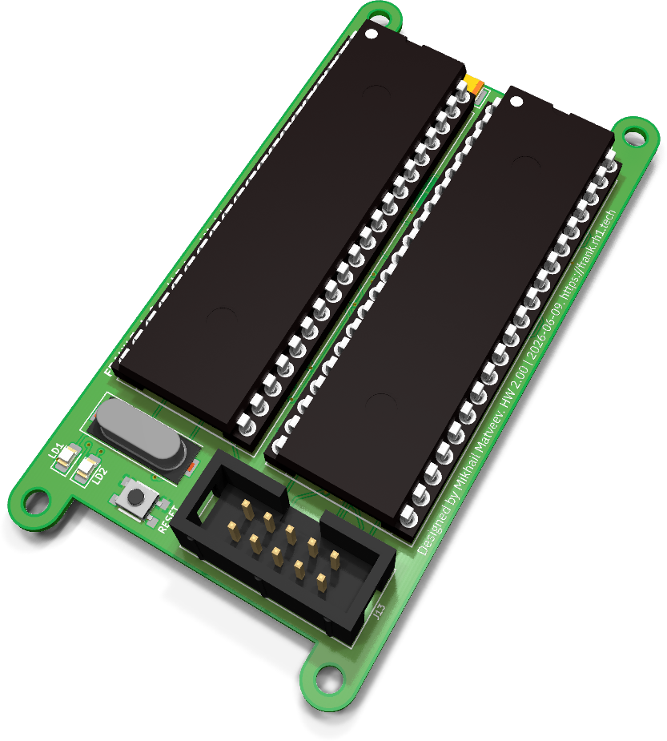
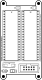
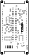

# TurboSound module assembly and usage guide

  

TurboSound is a sound-expansion module for FRANK: two YM2149 (AY-3-8910-compatible) PSG
chips on a single small board, giving you the classic ZX Spectrum 128 "TurboSound" dual-AY
setup with six square-wave channels plus noise. The chips sit in DIP-40 sockets so you can
fit genuine vintage or NOS parts.

> **Currently this module is only supported by [MiniFRANK](./minifrank.md).** It connects
> through MiniFRANK's expansion header. Support on other boards may follow.

- **PCB size:** 42 × 79.5 mm
- **Sound chips:** 2 × YM2149 / AY-3-8910 (DIP-40, socketed)
- **KiCad project:** [`hardware/turbosound/`](../hardware/turbosound)
- **Gerbers:** [`hardware/turbosound/gerbers/`](../hardware/turbosound/gerbers/)
- **BOM, schematics PDF, assembly drawing:** [`hardware/turbosound/docs/`](../hardware/turbosound/docs/)

## What's on the board

| Subsystem | Component(s) | Purpose |
|-----------|--------------|---------|
| Sound chips | 2 × YM2149 / AY-3-8910 (DIP-40 sockets) | Dual-AY TurboSound PSG |
| Clock | HC49-S crystal + 74HCT74 | Master clock and divider for both chips |
| Interface | 2×5 IDC header (2.54 mm) | Connection to the host (MiniFRANK) |
| Buffering | 2 × SOP-16 | Bus/level buffering |
| Indicators | 2 × LED (0805) | Status / activity |
| Mechanical | 4 × 2.7 mm mounting holes | Standoff mounting |

## Bill of materials (high-level)

The full, exact BOM is generated from the KiCad project and published as
[`hardware/turbosound/docs/<rev>/bom.html`](../hardware/turbosound/docs/). The headline
parts are two YM2149/AY-3-8910 chips (with DIP-40 sockets), the 74HCT74 divider, the
HC49-S crystal, the two SOP-16 buffers and the 2×5 IDC header.

## Assembly notes

- Solder the SMD parts (74HCT74, SOP-16 buffers, passives, LEDs) first, then the
  through-hole crystal, IDC header and the two DIP-40 sockets.
- **Socket the YM2149/AY-3-8910 — do not solder them directly.** Insert the chips only
  after the rest of the board is built, minding pin 1 orientation.
- The 2×5 IDC header is keyed; match it to the cable from the host board.

## Usage

1. Build MiniFRANK and the TurboSound module.
2. Connect the module to MiniFRANK's expansion header with a 2×5 IDC ribbon cable.
3. Run firmware that supports dual-AY / TurboSound output (for example the ZX Spectrum 128
   cores). The two PSGs are addressed as the primary and secondary AY.

## Silkscreen

| Top | Bottom |
|:---:|:---:|
|  |  |

## Troubleshooting

- **No sound / one channel set silent:** check both chips are seated correctly (pin 1) and
  that the crystal and 74HCT74 divider are populated — both AYs share the master clock.
- **Module not detected:** verify the 2×5 IDC cable orientation and that the firmware
  actually drives the secondary AY.
