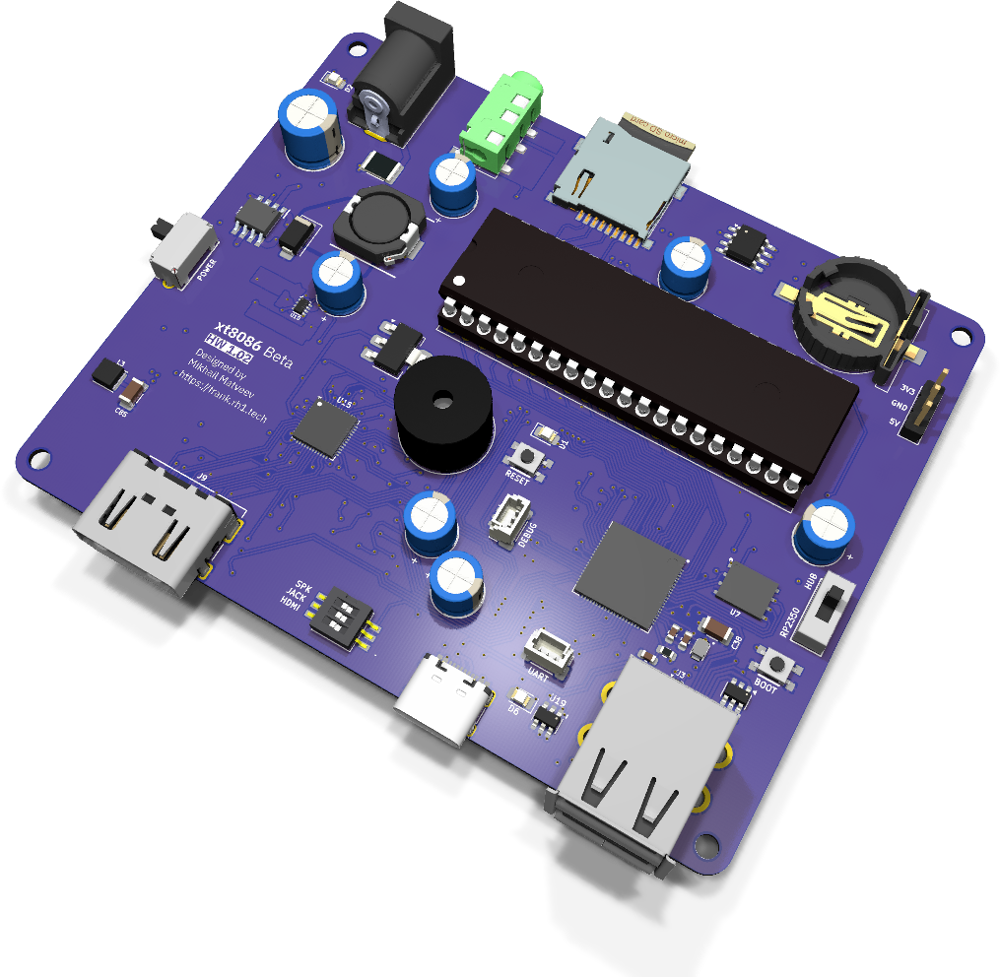
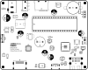
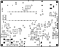

# XT8086 Beta: руководство по сборке и эксплуатации

  

XT8086 Beta ставит настоящий Intel 8086 в панельку DIP-40 и строит вокруг него машину класса IBM PC XT. Процессор 8086 работает в минимальном режиме с обвязкой на SN74LS04 и SN74LS74; RP2350B выступает в роли чипсета, обеспечивая память, видео, накопитель и ввод-вывод. Это именно PC, а не его эмуляция.

Видео выходит из RP2350B как RGB с таймингами VGA и прямо на плате преобразуется в HDMI микросхемой MS9288A, поэтому плата работает с современным монитором напрямую. Звук — PC speaker на транзисторе с 12-миллиметровым излучателем, плюс линейный выход 3.5 мм и перемычка, позволяющая выводить звук через HDMI. Часы DS3231MZ с элементом CR1220 сохраняют время, что машине такого класса весьма кстати.

Это **отдельная линия версий**, а не более поздняя ревизия платы [XT8086 Alpha](../hardware/xt8086_alpha). Alpha построена на модуле PGA2350 и имеет выходы VGA и композитный; Beta заменяет модуль на распаянный RP2350B, отказывается от VGA и композита в пользу HDMI и добавляет USB-хаб, сдвоенный порт host и часы реального времени.

- **Размер платы:** 99.50 × 80.00 mm
- **Вычислитель:** Intel 8086 (минимальный режим, панелька DIP-40) + RP2350B QFN-80 в роли чипсета
- **KiCad-проект:** [`hardware/xt8086_beta/`](../hardware/xt8086_beta)
- **Gerber-файлы:** [`hardware/xt8086_beta/gerbers/`](../hardware/xt8086_beta/gerbers/)
- **BOM, схемы PDF, сборочный чертеж:** [`hardware/xt8086_beta/docs/`](../hardware/xt8086_beta/docs/)

> **Недавно перенесено из [frank-lab](https://github.com/rh1tech/frank-lab).** Перед заказом
> печатной платы изучите схему и BOM.

## Состав платы

| Подсистема | Компонент(ы) | Назначение |
|------------|--------------|------------|
| Процессор | Intel 8086, панелька DIP-40 | Минимальный режим, съемный. |
| Обвязка | SN74LS04, SN74LS74 (SOIC-14) | Формирование тактов и управляющих сигналов. |
| Чипсет | RP2350B QFN-80 | Память, видео, накопитель и ввод-вывод. |
| Флеш-память | W25Q128JVPIQ | SPI-флеш 16 MB. |
| PSRAM | ESP-PSRAM64H | 8 MB PSRAM. |
| Тактирование | Генератор ASE-12 MHz | Тактирование RP2350B. |
| Видео | MS9288A + HDMI Type A | RGB с таймингами VGA, преобразованный в HDMI на плате. |
| Тактирование видео | 24.576 MHz + AMS1117-1.8 | Тактирование MS9288A и шина 1.8 V. |
| Звук | BC847 + излучатель 12 × 8.5 мм | PC speaker. |
| Аудиовыход | Гнездо 3.5 мм, перемычка HDMI-аудио | Линейный выход или звук через HDMI. |
| Часы | DS3231MZ + CR1220 | Часы реального времени с батарейкой. |
| USB host | Сдвоенный USB Type-A (2 порта) | Через хаб MW7211A. |
| Коммутация USB | TS3USB221 | Мультиплексирование host. |
| Защита USB | CH217K × 2, USBLC6 × 3, предохранитель 1.5 A | Ограничение тока и защита от статики. |
| USB (нативный) | USB Type-C | Нативный USB RP2350B. |
| Накопитель | Слот MicroSD | Образы дисков и ROM-образы. |
| Вход питания | Разъем DC-005, USB-C, гребенка на 3 контакта | Три источника. |
| Питание | MP1584EN, SY8089AAAC, AMS1117-1.8 | Шины 5 V, 3.3 V и 1.8 V. |
| Коммутация питания | TPS2116, AO3401A, перемычка Force On | Выбор источника и идеальный диод. |
| Переключатели | SS12D00, SK12D07VG3NS, DIP на 3 положения | Питание, режим, конфигурация. |
| Крепеж | 4 × Ø2.7 mm | Без металлизации. |

## Спецификация (BOM, обзор)

Полный точный BOM генерируется из KiCad-проекта и публикуется в файле
[`hardware/xt8086_beta/docs/<rev>/bom.html`](../hardware/xt8086_beta/docs/). Ключевые
компоненты — это Intel 8086 в панельке DIP-40, SN74LS04 и SN74LS74, RP2350B, флеш-память
W25Q128, ESP-PSRAM64H, преобразователь видео MS9288A, часы DS3231MZ и преобразователь MP1584EN.

## Замечания по сборке

- Сначала припаяйте RP2350B, флеш-память, PSRAM и MS9288A — это компоненты с мелким шагом,
  им нужен фен или нагревательный столик.
- Устанавливайте **панельку DIP-40**, а не сам 8086. Процессор вставляется после того, как
  шины питания проверены.
- Проверьте шину 1.8 V до установки MS9288A: преобразователь не переживет 3.3 V.
- LS04 и LS74 здесь в корпусах SOIC-14, а не в выводных DIP, как на плате Alpha.
- Разъем питания, сдвоенный USB и излучатель выступают над платой — паяйте их последними.

## Первый запуск

1. Проверьте шины 5 V, 3.3 V и 1.8 V при **пустой** панельке 8086.
2. Удерживая BOOT, подключите USB-C, отпустите кнопку и скопируйте файл `.uf2` на появившийся диск.
3. Обесточьте плату, вставьте 8086, соблюдая положение первого вывода, и включите снова.
4. Подключите дисплей HDMI.
5. Подключите USB-клавиатуру к сдвоенному порту и установите карту MicroSD.
6. Установите элемент CR1220, чтобы часы сохраняли время при выключении.

## Совместимость прошивок

XT8086 Beta работает со своей собственной прошивкой чипсета для RP2350B — это не целевая
платформа для эмуляционных прошивок FRANK, которые предполагают, что RP2350 является
процессором, а не вспомогательной микросхемой. Видео только по HDMI (через MS9288A), ввод
только по USB, WiFi и входа магнитофона на этой плате нет.

## Шелкография

| Верх | Низ |
|:---:|:---:|
|  |  |

## Поиск и устранение неисправностей

- **Нет изображения:** MS9288A требует шины 1.8 V и тактирования 24.576 MHz. Проверьте и то,
  и другое, прежде чем подозревать RP2350B.
- **8086 не запускается:** проверьте положение первого вывода в панельке и правильность
  ориентации LS04 и LS74.
- **Нет звука:** проверьте перемычку HDMI-аудио. Когда она установлена, звук выводится через
  HDMI, а не через гнездо 3.5 мм.
- **Сбрасываются часы:** установите элемент CR1220; DS3231MZ сохраняет время только при наличии
  резервного питания.
- **Плата не питается от разъема DC:** выбором источника занимается TPS2116; убедитесь, что
  полярность «плюс в центре» и предохранитель цел.
