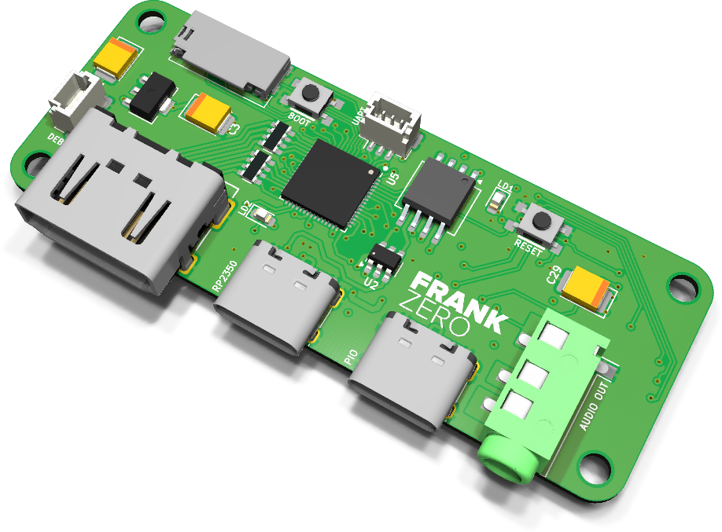
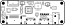
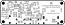

# ZeroFRANK assembly and usage guide

  

ZeroFRANK is the minimalist FRANK: an RP2350A soldered directly to a tiny board with HDMI out, two USB-C ports and a MicroSD slot. No VGA, no PS/2, no gamepad ports, no WiFi — keyboards, mice and gamepads all connect over USB. It is the smallest way to get a FRANK-class RP2350A running HDMI video.

One USB-C carries the RP2350's native USB; the second is a PIO-USB host port for input devices. Audio comes out of an on-board TDA1387 DAC to a 3.5 mm jack. A 3-pin JST-SH SWD port plus BOOT and RESET buttons round it out.

- **PCB size:** 65 × 25 mm
- **Compute:** RP2350A QFN-60, on-board
- **KiCad project:** [`hardware/zerofrank/`](../hardware/zerofrank)
- **Gerbers:** [`hardware/zerofrank/gerbers/`](../hardware/zerofrank/gerbers/)
- **BOM, schematics PDF, assembly drawing:** [`hardware/zerofrank/docs/`](../hardware/zerofrank/docs/)

> **Recently promoted from [frank-lab](https://github.com/rh1tech/frank-lab).** ZeroFRANK
> has no on-board PSRAM, so firmware that requires 8 MB PSRAM will not run on it. Review
> the schematic and BOM before ordering a PCB.

## What's on the board

| Subsystem | Component(s) | Purpose |
|-----------|--------------|---------|
| Compute | RP2350A QFN-60 | Soldered directly to the PCB |
| Flash | QSPI flash (SOIC-8) | Firmware storage |
| Video | HDMI Type A | HDMI out (HDMI only — no VGA, no composite) |
| USB (native) | USB Type-C | RP2350 native USB |
| USB host | USB Type-C (PIO-USB) | Keyboards, mice and gamepads over USB |
| Audio out | TDA1387T + 3.5 mm jack | I²S line-level audio |
| Storage | MicroSD slot | ROMs, WADs, disk images |
| Debug | 3-pin JST-SH SWD | Serial-wire debug |
| Buttons | BOOT, RESET | Bootsel + reset |
| Headers | UART | Debug serial |

## Bill of materials (high-level)

The full, exact BOM is generated from the KiCad project and published as
[`hardware/zerofrank/docs/<rev>/bom.html`](../hardware/zerofrank/docs/). The headline parts
are the RP2350A QFN-60, a QSPI flash, the TDA1387T DAC, an LDO and the HDMI / USB-C /
MicroSD connectors.

## Assembly notes

- The RP2350A is a QFN-60 — use hot air or a hot plate. Solder it and the flash first,
  then the LDO and passives, then the connectors.
- 0402/0603 passives dominate; a microscope or magnifier helps.
- Because there is no PSRAM, stick to firmware that runs from SRAM/flash (see notes below).

## First boot

1. Hold BOOT, connect the native USB-C, release, and copy a `.uf2` to the drive that
   appears (or use `picotool load`).
2. Connect an HDMI display.
3. Plug a USB keyboard / mouse / gamepad into the PIO-USB host port.
4. Insert a MicroSD card with ROMs or disk images.

## Firmware compatibility

ZeroFRANK has **no on-board PSRAM**. Firmware that requires 8 MB PSRAM (frank-os,
frank-386, frank-snes, frank-genesis, frank-quest, the id Tech 1 ports and so on) will not
run. Firmware that does not require PSRAM — such as [frank-kickstart](https://github.com/rh1tech/frank-kickstart),
[frank-digger](https://github.com/rh1tech/frank-digger) and many of the original Murmulator
ZX Spectrum cores — is the right fit.

## Silkscreen

| Top | Bottom |
|:---:|:---:|
|  |  |

## Troubleshooting

- **No video:** confirm the firmware targets HDMI (ZeroFRANK has no VGA) and that the
  RP2350A and flash are soldered cleanly.
- **No USB input:** input devices go on the **PIO-USB** Type-C port, not the native one.
- **Firmware won't boot:** check it does not require PSRAM — ZeroFRANK has none.
