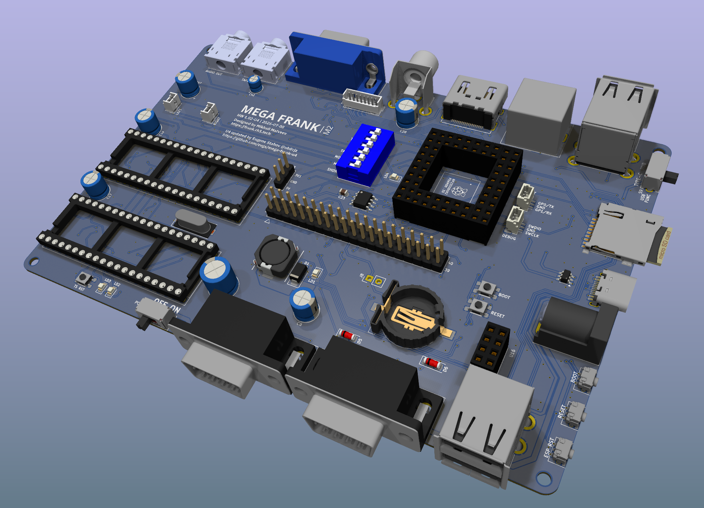

# MEGAFRANK 1.02-U4
MegaFRANK is a hardware emulation platform built around the Raspberry Pi RP2350 QFN module

## DISCLAIMER 
This megafrank-u4 board is a sub-fork from https://github.com/rh1tech/frank repository originally designed by [Mikhail Matveev](https://github.com/xtremespb), [r1tech](https://github.com/rh1tech)

## Changes
- Two stacked USB-A ports were added on front board edge. 4 USB-A host ports total
- Power barrel 5mm connector was moved to right edge of the board
- ESP-RESET connected to PGPIO36 (optional, available if S11 jumper is closed) 

## DIP Switches S1 description
| Switch | Function                                                   |
| ------ | ---------------------------------------------------------- |
| TDA    | Sound path through I2S TDA (On) or PWM (Off)               |
| TS     | Enable TurboSound path (On)                                |
| TAPE   | Connect TAPE IN analog input to RP2540B                    |
| MONO   | Mono (On) of Stereo (Off) sound path                       |
| MPU    | Enable +3V3 external pullup on GPIO0/1 (Mouse/UART port)   |
| SHDN   | Shutdown (On) speaker amplifier PAM8403 (outputs J13, J14) |

## TDA/TS switches useful combinations
| TDA    | TS     | Output selected        |
| ------ | ------ | ---------------------- |
| off    | off    | RP2350 PWM             |
| **ON** | off    | I2S TDA1387T           |
| off    | **ON** | Turbosound 2xAY-3-8910 |
| **ON** | **ON** | Output Disabled        |

Please read detailed docs in original project [FRANK repository](https://github.com/rh1tech/frank)
